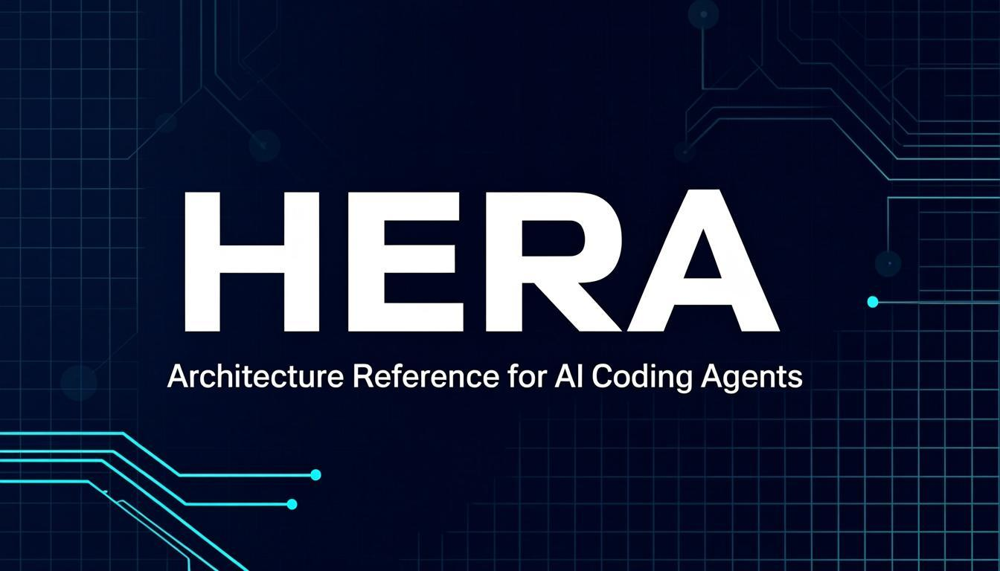

<p align="center">
  
</p>

<p align="center">
  <strong>The most comprehensive architectural reference for building production-grade AI coding agents.</strong><br>
  Verified from 9 open-source codebases with <strong>770K+</strong> combined GitHub stars.
</p>

<p align="center">
  
  
  
  
  
  
  
</p>

<p align="center">
  <a href="#-quick-start"><strong>Quick Start</strong></a> &nbsp;·&nbsp;
  <a href="#-installation"><strong>Install</strong></a> &nbsp;·&nbsp;
  <a href="#-whats-inside"><strong>What's Inside</strong></a> &nbsp;·&nbsp;
  <a href="#-supported-agents"><strong>Agents</strong></a> &nbsp;·&nbsp;
  <a href="#-architecture"><strong>Architecture</strong></a> &nbsp;·&nbsp;
  <a href="#-documentation"><strong>Docs</strong></a>
</p>

---

<br>

## ⚡ Quick Start

```bash
# One command — auto-detects your agent
npx hera-agent

# Or specify your agent
npx hera-agent claude
npx hera-agent hermes
npx hera-agent cursor
```

> **What you get:** Complete architecture reference, 28+ copy-paste templates, 18 reference files, 3 full working example agents, validation checklist, security patterns, and more — all verified from real production codebases.

<br>

## 🎯 What is Hera?

Hera is a **technical knowledge base** that explains how production-grade AI coding agents work internally. Every pattern, every decision, every pitfall — verified against actual open-source codebases.

> **Important:** Hera is a **SKILL**, not a product, framework, or competitor. It learns from other agents — it does not compete with them.

### Repos Studied

<table>
<tr>
<td width="180"><strong>Pi Agent</strong></td>
<td width="80"></td>
<td>Two-loop agent, tree sessions, extensions, provider abstraction</td>
</tr>
<tr>
<td><strong>ECC</strong></td>
<td></td>
<td>64 specialized agents, autonomous loops, self-debugging, hooks</td>
</tr>
<tr>
<td><strong>OpenClaw</strong></td>
<td></td>
<td>Agent-harness, branch compaction, context engineering</td>
</tr>
<tr>
<td><strong>Aider</strong></td>
<td></td>
<td>Edit formats, fuzzy match, architect mode, git-native patterns</td>
</tr>
<tr>
<td><strong>OpenCode</strong></td>
<td></td>
<td>Effect-TS, permission system, plugins, TypeScript errors</td>
</tr>
<tr>
<td><strong>Kilo Code</strong></td>
<td></td>
<td>Scout mode, reference guidance, task coordination</td>
</tr>
<tr>
<td><strong>GSD Core</strong></td>
<td></td>
<td>Spec-driven development, multi-agent orchestration</td>
</tr>
<tr>
<td><strong>RTK</strong></td>
<td></td>
<td>Token optimization (60–90% reduction)</td>
</tr>
<tr>
<td><strong>Headroom</strong></td>
<td></td>
<td>Context compression (60–95% reduction, 6 algorithms)</td>
</tr>
</table>

<br>

## 📦 Installation

### Option 1: npx skills (recommended)

```bash
npx skills add ahmdd4vd/hera
```

### Option 2: npx hera-agent

```bash
npx hera-agent              # Auto-detect
npx hera-agent claude       # Specific agent
npx hera-agent --yes        # Skip confirmation (CI/CD)
npx hera-agent --version-tag v2.10.0  # Pin version
```

### Option 3: One-liner

```bash
curl -sSL https://raw.githubusercontent.com/ahmdd4vd/hera/main/install.sh | bash
```

### Option 4: Clone & Install

```bash
git clone https://github.com/ahmdd4vd/hera.git && cd hera
./install.sh claude
```

### Option 5: Manual

Copy the right file to the right place. See [agent mapping table](#-supported-agents) below.

### What the Installer Does

<table>
<tr><th>Step</th><th>Description</th></tr>
<tr><td>🔍 <strong>Auto-detect</strong></td><td>Scoring-based detection finds your agent (files, dirs, commands, homeDirs)</td></tr>
<tr><td>✅ <strong>Confirm</strong></td><td>Interactive prompt shows detected agent — you confirm before anything happens</td></tr>
<tr><td>💾 <strong>Backup</strong></td><td>Existing files are backed up as <code>.hera-backup</code> before overwriting</td></tr>
<tr><td>📥 <strong>Download</strong></td><td>Files fetched from GitHub raw with content validation (min 50 chars, HTML rejection, markdown check)</td></tr>
<tr><td>📍 <strong>Place</strong></td><td>Each file goes to the correct location for your specific agent</td></tr>
</table>

<br>

## 🤖 Supported Agents

<p align="center">
  <strong>18 AI coding agents</strong> — one command to install for any of them
</p>

<table>
<tr>
<th align="center">Agent</th>
<th align="center">Install Command</th>
<th align="center">File</th>
<th align="center">Location</th>
</tr>
<tr>
<td> &nbsp;Claude Code</td>
<td><code>npx hera-agent claude</code></td>
<td><code>CLAUDE.md</code></td>
<td>Project root</td>
</tr>
<tr>
<td> &nbsp;Hermes</td>
<td><code>npx hera-agent hermes</code></td>
<td><code>SKILL.md</code></td>
<td><code>~/.hermes/skills/hera/</code></td>
</tr>
<tr>
<td> &nbsp;Cursor</td>
<td><code>npx hera-agent cursor</code></td>
<td><code>hera.mdc</code></td>
<td><code>.cursor/rules/</code></td>
</tr>
<tr>
<td> &nbsp;OpenCode</td>
<td><code>npx hera-agent opencode</code></td>
<td><code>AGENTS.md</code></td>
<td>Project root</td>
</tr>
<tr>
<td> &nbsp;Codex</td>
<td><code>npx hera-agent codex</code></td>
<td><code>AGENTS.md</code></td>
<td>Project root</td>
</tr>
<tr>
<td> &nbsp;Kilo Code</td>
<td><code>npx hera-agent kilo</code></td>
<td><code>SKILL.md</code></td>
<td><code>.kilo/skills/hera/</code></td>
</tr>
<tr>
<td> &nbsp;Kiro</td>
<td><code>npx hera-agent kiro</code></td>
<td><code>SKILL.md</code></td>
<td><code>.kiro/skills/hera/</code></td>
</tr>
<tr>
<td> &nbsp;Aider</td>
<td><code>npx hera-agent aider</code></td>
<td><code>AGENTS.md</code></td>
<td>Project root</td>
</tr>
<tr>
<td> &nbsp;Gemini CLI</td>
<td><code>npx hera-agent gemini</code></td>
<td><code>GEMINI.md</code></td>
<td>Project root</td>
</tr>
<tr>
<td> &nbsp;Pi</td>
<td><code>npx hera-agent pi</code></td>
<td><code>SKILL.md</code></td>
<td><code>~/.pi/agent/skills/hera/</code></td>
</tr>
<tr>
<td> &nbsp;GitHub Copilot</td>
<td><code>npx hera-agent copilot</code></td>
<td><code>SKILL.md</code></td>
<td><code>~/.copilot/skills/hera/</code></td>
</tr>
<tr>
<td> &nbsp;Devin</td>
<td><code>npx hera-agent devin</code></td>
<td><code>SKILL.md</code></td>
<td><code>~/.config/devin/skills/hera/</code></td>
</tr>
<tr>
<td> &nbsp;Antigravity</td>
<td><code>npx hera-agent antigravity</code></td>
<td><code>hera.md</code></td>
<td><code>.agents/rules/</code></td>
</tr>
<tr>
<td> &nbsp;Amp</td>
<td><code>npx hera-agent amp</code></td>
<td><code>AGENTS.md</code></td>
<td>Project root</td>
</tr>
<tr>
<td> &nbsp;Trae</td>
<td><code>npx hera-agent trae</code></td>
<td><code>AGENTS.md</code></td>
<td>Project root</td>
</tr>
<tr>
<td> &nbsp;CodeBuddy</td>
<td><code>npx hera-agent codebuddy</code></td>
<td><code>SKILL.md</code></td>
<td><code>~/.codebuddy/skills/hera/</code></td>
</tr>
<tr>
<td> &nbsp;OpenClaw</td>
<td><code>npx hera-agent claw</code></td>
<td><code>CLAW.md</code></td>
<td>Project root</td>
</tr>
<tr>
<td> &nbsp;Factory Droid</td>
<td><code>npx hera-agent droid</code></td>
<td><code>AGENTS.md</code></td>
<td>Project root</td>
</tr>
<tr>
<td colspan="4" align="center"><strong>All agents</strong> &nbsp;→&nbsp; <code>npx hera-agent all</code> or <code>./install.sh all</code></td>
</tr>
</table>

<br>

## 📚 What's Inside

### SKILL.md — Main Reference

<p>
  
  
  
</p>

| # | Section | What You'll Learn |
|:---:|---------|-------------------|
| 1 | **Package Structure** | 4 packages and how they depend on each other |
| 2 | **Core Types** | Message, AgentState, AgentTool, AgentEvent definitions |
| 3 | **Agent Loop** | The main loop that calls LLM and executes tools |
| 4 | **Agent Class** | Stateful wrapper with message queueing |
| 5 | **Agent Harness** | Orchestration layer with session, hooks, compaction |
| 6 | **Session System** | Tree-based conversation storage with branching |
| 7 | **Compaction** | Auto-summarize old messages to fit context window |
| 8 | **Message Conversion** | How custom messages become LLM-compatible messages |
| 9 | **Tool System** | 7 built-in tools (read, write, edit, bash, grep, find, ls) |
| 10 | **Extension System** | Plugin system with lifecycle hooks and UI primitives |
| 11 | **AI Layer** | Provider abstraction, custom providers, fallback chain |
| 12 | **System Prompt** | How the system prompt is constructed |
| 13 | **Skills & Templates** | How skills and prompt templates are loaded |
| 14 | **Event Architecture** | Full event flow from user input to response |
| 15 | **Design Patterns** | 8 patterns used throughout the codebase |
| 16 | **Implementation Guide** | Step-by-step order to build your own agent |
| 17 | **Pitfalls** | 8 mistakes to avoid |
| 18 | **Multi-Agent Knowledge** | 10 patterns, 15 decision points, 15 anti-patterns |
| 19 | **Innovation Patterns** | FAST / SMART / NOT STUPID patterns |
| 20 | **Architecture Diagrams** | 6 Mermaid diagrams |
| 21 | **Validation Checklist** | 11 categories with 50+ checkboxes |
| 22 | **Code Templates** | 6 TypeScript + 6 Python templates |
| 23 | **Security Patterns** | Tool sandboxing, permissions, I/O sanitization |
| 24 | **Error Handling** | Retry, graceful degradation, error propagation |
| 25 | **Testing Patterns** | Unit, integration, E2E tests with mocks and fixtures |
| 26 | **CLI Tools** | `hera init` (scaffold) and `hera validate` (verify) |
| 27 | **Example Agent** | Complete working agent (TypeScript + Python) |
| 28 | **Deployment** | Local, Docker, cloud deployment with monitoring |
| 29 | **GitHub Actions** | CI/CD integration for automated validation |
| 30 | **Production Patterns** | Task routing, streaming, memory management |
| 31 | **Spec-Driven Development** | Pipeline from spec to code with multi-agent orchestration |
| 32 | **Token Optimization** | 6 strategies for 60–95% token reduction |

<br>

### Reference Files — Deep Dives

<p>
  
  
</p>

| File | Lines | Deep Dive Into |
|------|------:|----------------|
| `references/hermes-architecture.md` | 16,068 | Hermes Agent: multi-platform gateway (20+), self-improving skills with curator, provider-agnostic, MCP-native, cron scheduler |
| `references/aider-architecture.md` | 15,320 | Aider: 6 edit formats, architect mode, repo map (tree-sitter + PageRank), fuzzy match, reflection loop |
| `references/claude-code-architecture.md` | 14,279 | Claude Code: query loop (2,240 lines), 50+ tools, 7 permission modes, hook system, subagent system |
| `references/ecc-architecture.md` | 8,990 | ECC Plugin: 64 specialized agents, 17 hooks, rules per language, 262 skills |
| `references/opencode-architecture.md` | 8,291 | OpenCode Go: agent loop (758 lines), 11 providers, 10 tools, permission system |
| `references/kilocode-architecture.md` | 5,417 | Kilo Code: Agent Manager, auto-generated SDK, gateway pattern, worktree isolation |
| `references/advanced-patterns.md` | 911 | 8 production features: MCP, Skills, Memory, Plugins, Cost Tracking, Observability |
| `references/agent-loop-harness.md` | — | Agent loop + class + harness extracted from SKILL.md §3–5 |
| `references/session-and-compaction.md` | — | Session tree + compaction extracted from SKILL.md §6–7 |
| `references/ai-providers-layer.md` | — | Provider abstraction extracted from SKILL.md §11 |
| `references/9router-architecture.md` | — | 9router: unified multi-provider routing with OAuth |
| `references/multi-provider-routing.md` | — | Multi-provider routing patterns, OAuth, fallback chains |
| `references/provider-model-catalog.md` | — | Model catalog across all providers |
| `references/codex-architecture.md` | — | Codex architecture deep analysis |
| `references/ecc-patterns.md` | 400 | ECC patterns: agent harness, autonomous loops, self-debugging |
| `references/token-optimization.md` | 479 | 6 compression strategies (60–95% reduction) |
| `references/spec-driven-development.md` | 132 | Spec pipeline, multi-agent orchestration, context engineering |
| `references/innovation-patterns.md` | 69 | FAST / SMART / NOT STUPID patterns from all repos |

<br>

### Templates — Copy-Paste Ready

<p>
  
  
  
</p>

<details>
<summary><strong>TypeScript Templates (14)</strong></summary>

| Template | Description |
|----------|-------------|
| `minimal-agent-loop.ts` | Two-loop agent with steering and follow-up |
| `minimal-tool.ts` | Tool system with validation and parallel execution |
| `minimal-session.ts` | Tree-based session with branching |
| `minimal-provider.ts` | Provider abstraction with streaming |
| `minimal-harness.ts` | Orchestration with hooks and compaction |
| `minimal-extension.ts` | Plugin system with lifecycle hooks |
| `minimal-provider-fallback.ts` | Fallback chain for reliability |
| `minimal-streaming.ts` | Streaming with backpressure |
| `multi-provider-router.ts` | Multi-provider routing |
| `mcp-server.ts` | MCP server implementation |
| `mcp-client.ts` | MCP client implementation |
| `mcp-stdio-sse-bridge.ts` | MCP stdio-SSE bridge |
| `mcp-marketplace.ts` | MCP marketplace |
| `antigravity-wrapper.ts` | Antigravity agent wrapper |

</details>

<details>
<summary><strong>Python Templates (9)</strong></summary>

| Template | Description |
|----------|-------------|
| `minimal_agent_loop.py` | Two-loop agent with steering |
| `minimal_tool.py` | Tool system with validation |
| `minimal_session.py` | Tree-based session |
| `minimal_provider.py` | Provider abstraction |
| `minimal_harness.py` | Orchestration with hooks |
| `minimal_extension.py` | Plugin system |
| `minimal_provider_fallback.py` | Fallback chain |
| `minimal_streaming.py` | Streaming implementation |
| `multi-provider-router.py` | Multi-provider routing |

</details>

<details>
<summary><strong>Infrastructure Templates (7+)</strong></summary>

| Template | Description |
|----------|-------------|
| `api-key-validator.ts` | API key validation and rotation |
| `tts-provider.ts` | Text-to-speech provider |
| `stt-provider.ts` | Speech-to-text provider |
| `image-provider.ts` | Image generation provider |
| `embedding-provider.ts` | Embedding provider |
| `web-search.ts` | Web search provider |
| `web-fetch.ts` | Web content fetching |
| `quota-tracker.ts` | Usage quota tracking |
| `spoof-headers.ts` | Header management |
| `tunnel.ts` / `tunnel-cloudflare.ts` / `tunnel-tailscale.ts` | Tunnel providers |
| `updater.ts` | Self-update mechanism |
| `multimodal-input.ts` | Multi-modal input handling |

</details>

<br>

### Example Agents — Full Working Implementations

| Example | Language | Description |
|---------|----------|-------------|
| `examples/full-agent/` | TypeScript | Complete agent with tools, session, provider, tests |
| `examples/python-agent/` | Python | Complete agent with 29 tests, multi-provider, CLI |
| `examples/full-stack-agent/` | TypeScript | Full-stack agent with all features |

<br>

## 🏛️ Architecture

### Key Architecture Decisions

<table>
<tr>
<td width="200"><strong>🔄 Two-Loop Agent Loop</strong></td>
<td>Inner loop handles tool calls and mid-run user messages (steering). Outer loop handles follow-up messages that arrive after the agent would normally stop.</td>
</tr>
<tr>
<td><strong>🌳 Tree-Based Sessions</strong></td>
<td>Conversations stored as a tree, not a linear log. Fork from any point and explore different paths.</td>
</tr>
<tr>
<td><strong>📦 Built-in Compaction</strong></td>
<td>When context window gets too long, old messages are auto-summarized. Recent messages kept intact.</td>
</tr>
<tr>
<td><strong>📨 Queue-Based Steering</strong></td>
<td>Inject messages while the agent is running. Three queue types: steer (mid-run), follow-up (after stop), next-turn (prepend).</td>
</tr>
<tr>
<td><strong>🔌 Provider Abstraction</strong></td>
<td>Same API for 20+ providers (OpenAI, Anthropic, Google, Bedrock, etc.). Fallback chains ensure reliability.</td>
</tr>
<tr>
<td><strong>♾️ Autonomous Loops</strong></td>
<td>Six loop patterns from ECC: sequential, infinite, PR loop, de-sloppify, multi-agent DAG, RFC-driven.</td>
</tr>
<tr>
<td><strong>📉 Token Optimization</strong></td>
<td>Six compression strategies: command output, diff/search/log, live zone, adaptive. 60–95% reduction.</td>
</tr>
</table>

### Architecture Diagrams (6 Mermaid)

SKILL.md includes 6 Mermaid diagrams that render on GitHub:

1. **Agent Loop** — Two-loop design (outer: follow-up, inner: steering + tools)
2. **Tool Execution Flow** — How tools are prepared, validated, and executed
3. **Session Tree Structure** — How conversations branch and compact
4. **Event Flow Sequence** — Complete event lifecycle from user input to response
5. **Extension System** — How extensions register tools, commands, and event handlers
6. **Package Dependencies** — How the 4 packages depend on each other

<br>

## 🧩 Hera Framework

**HERA_FRAMEWORK.md** (663 lines) — A structural framework based on AGENTS.md hierarchy that keeps any agent project organized and maintainable.

| Feature | Details |
|---------|---------|
| **5 Project Templates** | coding-agent, web-app, library, api-server, monorepo |
| **3 Real Examples** | Pi Agent, OpenClaw, Aider architecture breakdowns |
| **8 Agent-Specific Guidance** | Claude Code, OpenCode, Cursor, Kilo Code, OpenClaw, Hermes, Pi, Copilot |
| **16 Validation Checks** | Structure, naming, hierarchy, consistency |
| **6 Anti-Patterns** | Common mistakes with examples and fixes |

<br>

## 📂 File Structure

```
hera/
├── 📄 AGENTS.md                          Root contract (Hera Framework)
├── 📄 HERA_FRAMEWORK.md                  Structural framework (663 lines)
├── 📄 SKILL.md                           Architecture reference (2,412 lines, 32 sections)
├── 📄 CLAUDE.md                          Claude Code config
├── 📄 README.md                          This file
├── 📄 CHANGELOG.md                       Version history
├── 📄 CONTRIBUTING.md                    How to contribute
├── 📄 DEPLOYMENT.md                      Deployment guide
├── 📄 ERROR_HANDLING.md                  Error handling patterns
├── 📄 SECURITY.md                        Security patterns
├── 📄 TESTING.md                         Testing patterns
├── 📄 LICENSE                            MIT License
│
├── 📁 references/                        Deep-dive reference files (18 files)
│   ├── hermes-architecture.md            Hermes deep analysis (16,068 lines)
│   ├── aider-architecture.md             Aider deep analysis (15,320 lines)
│   ├── claude-code-architecture.md       Claude Code deep analysis (14,279 lines)
│   ├── ecc-architecture.md              ECC deep analysis (8,990 lines)
│   ├── opencode-architecture.md         OpenCode deep analysis (8,291 lines)
│   ├── kilocode-architecture.md         Kilo Code deep analysis (5,417 lines)
│   ├── advanced-patterns.md             8 production features
│   ├── agent-loop-harness.md            Agent loop + class + harness
│   ├── session-and-compaction.md        Session tree + compaction
│   ├── ai-providers-layer.md            Provider abstraction
│   ├── 9router-architecture.md          Multi-provider routing
│   ├── multi-provider-routing.md        Routing patterns with OAuth
│   ├── provider-model-catalog.md        Model catalog
│   ├── codex-architecture.md            Codex architecture
│   ├── ecc-patterns.md                  ECC patterns
│   ├── token-optimization.md            Token optimization (6 strategies)
│   ├── spec-driven-development.md       Spec-driven development
│   └── innovation-patterns.md           Innovation patterns
│
├── 📁 templates/                         Copy-paste ready code (30 files)
│   ├── TypeScript (14)                  Agent, tool, session, provider, harness, extension, MCP...
│   ├── Python (9)                       Agent, tool, session, provider, harness, extension...
│   └── Infrastructure (7+)              TTS, STT, image, embedding, web search, tunnel, quota...
│
├── 📁 examples/                          Full working agents
│   ├── full-agent/                      TypeScript example agent
│   ├── python-agent/                    Python example agent (29 tests)
│   └── full-stack-agent/               Full-stack example agent
│
├── 📁 docs/                              Supplementary documentation
│   ├── PATTERNS.md                      Production patterns
│   ├── STREAMING.md                     Streaming patterns
│   ├── MEMORY.md                        Memory management
│   └── ROUTING.md                       Provider routing
│
├── 📁 cli/                               CLI tools
│   ├── hera-init.ts                     Scaffold CLI
│   ├── hera-validate.ts                 Validation CLI
│   ├── hera-graph.ts                    Knowledge graph visualization
│   └── index.ts                         Main CLI entry (install subcommand)
│
├── 📁 bin/                               Distribution
│   └── hera.cjs                         Standalone CLI (1,172 lines)
│
├── 📁 .github/                           CI/CD
│   ├── workflows/ci.yml                GitHub Actions CI pipeline
│   └── actions/validate/               Validation action
│
├── 📁 .cursor/rules/                    Cursor config
│   └── hera.mdc
├── 📁 .agents/rules/                    Antigravity config
│   └── hera.md
├── 📁 .agents/workflows/                Antigravity workflows
│   └── hera.md
├── 📁 .kiro/skills/hera/               Kiro config
│   └── SKILL.md
└── 📁 .kilo/skills/hera/               Kilo Code config
    └── SKILL.md
```

<br>

## 📊 Stats

<table>
<tr>
<td align="center" width="25%">
<br>
<sub>32 sections</sub>
</td>
<td align="center" width="25%">
<br>
<sub>18 files</sub>
</td>
<td align="center" width="25%">
<br>
<sub>14 TS + 9 PY + 7 infra</sub>
</td>
<td align="center" width="25%">
<br>
<sub>across all source files</sub>
</td>
</tr>
<tr>
<td align="center">
<br>
<sub>TS + Python + Full-stack</sub>
</td>
<td align="center">
<br>
<sub>770K+ combined stars</sub>
</td>
<td align="center">
<br>
<sub>Full architecture analyses</sub>
</td>
<td align="center">
<br>
<sub>Install in one command</sub>
</td>
</tr>
</table>

<br>

## 📖 Documentation

| Document | Description |
|----------|-------------|
| [SKILL.md](SKILL.md) | Main architecture reference (2,412 lines, 32 sections) |
| [HERA_FRAMEWORK.md](HERA_FRAMEWORK.md) | Structural framework (663 lines) |
| [AGENTS.md](AGENTS.md) | Root contract for Hera Framework |
| [CHANGELOG.md](CHANGELOG.md) | Version history |
| [CONTRIBUTING.md](CONTRIBUTING.md) | How to contribute |
| [DEPLOYMENT.md](DEPLOYMENT.md) | Deployment guide |
| [ERROR_HANDLING.md](ERROR_HANDLING.md) | Error handling patterns |
| [SECURITY.md](SECURITY.md) | Security patterns |
| [TESTING.md](TESTING.md) | Testing patterns |

<br>

---

<p align="center">
  <br>
  <strong>Hera</strong> — Architecture Reference for AI Coding Agents<br><br>
  Built by <a href="https://github.com/ahmdd4vd"><strong>ahmdd4vd</strong></a> · Licensed under <a href="LICENSE">MIT</a><br><br>
  <sub>If Hera helped you build something awesome, consider giving it a ⭐</sub>
</p>
