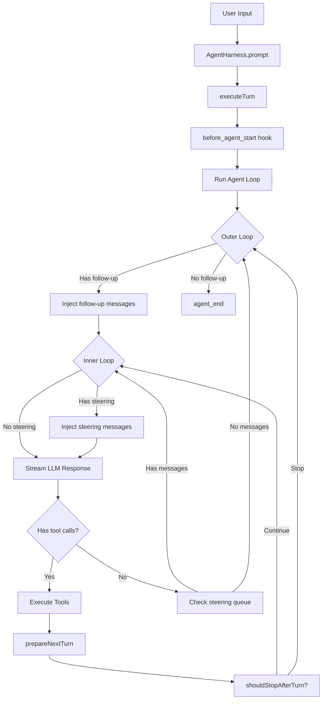
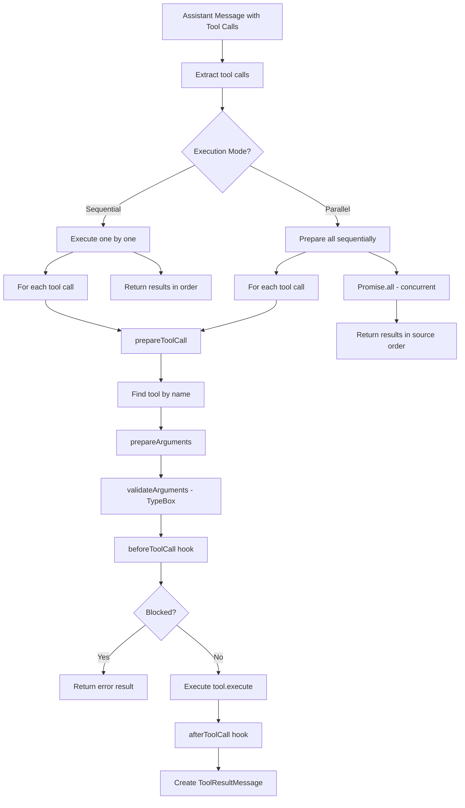
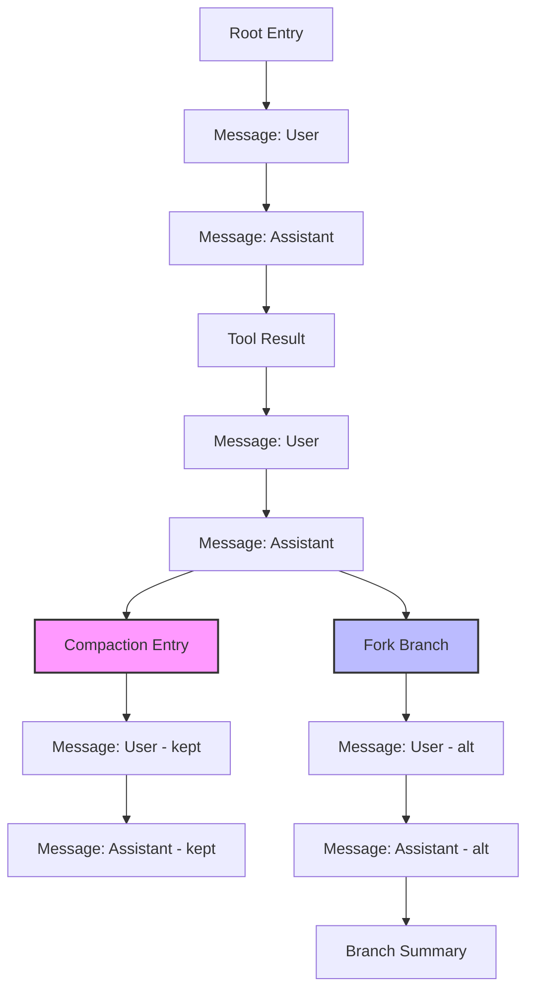
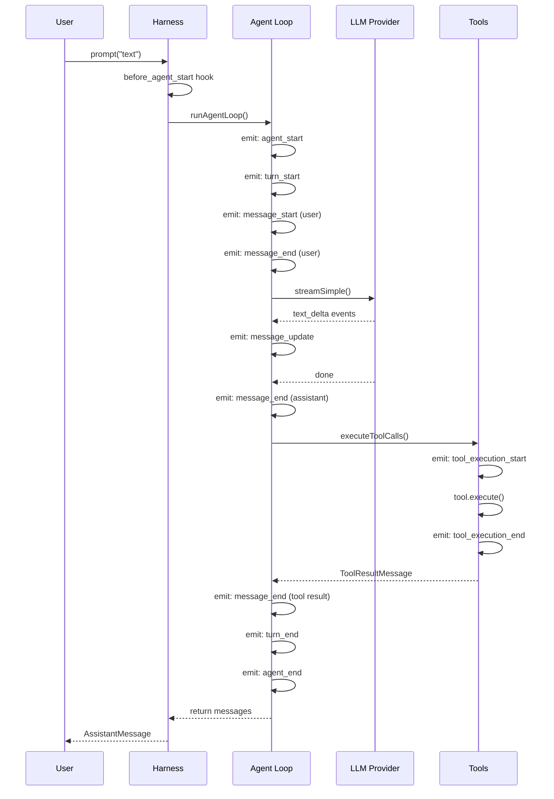
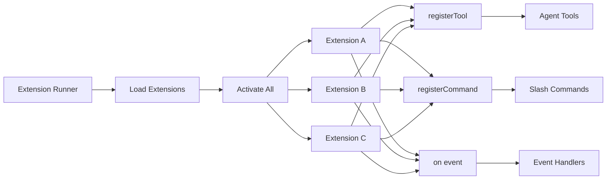
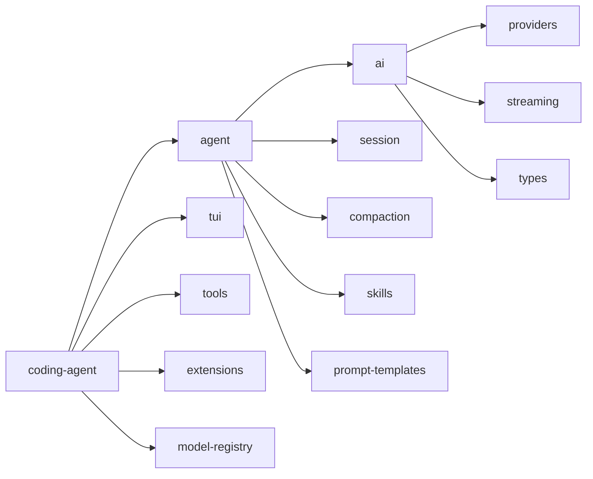

# Hera — AI Coding Agent Architecture Reference

**Hera** is a complete architectural reference for building production-grade AI coding agents. Every detail is verified from the [Pi Agent](https://github.com/earendil-works/pi) source code (62K stars, TypeScript monorepo).

Use this to build your own coding agent, understand how existing agents work internally, or extend them with new capabilities.

---

## 1. PACKAGE STRUCTURE

```
packages/
├── ai/              → Unified LLM API (provider abstraction, streaming, types)
├── agent/           → Agent runtime (loop, harness, session, compaction)
├── coding-agent/    → Interactive CLI (tools, extensions, TUI modes, config)
└── tui/             → Terminal UI rendering engine (differential rendering)
```

**Dependency flow**: `coding-agent → agent → ai` (each package depends on the one to its left)

---

## 2. CORE TYPES (`packages/agent/src/types.ts`)

### 2.1 Message System

```typescript
// Base LLM messages (from pi-ai)
type Message = UserMessage | AssistantMessage | ToolResultMessage;

// Agent messages = LLM messages + custom app messages
type AgentMessage = Message | CustomAgentMessages[keyof CustomAgentMessages];

// Custom messages via declaration merging:
interface CustomAgentMessages {
  bashExecution: BashExecutionMessage;  // Shell command results
  custom: CustomMessage;                // Extension-injected messages
  branchSummary: BranchSummaryMessage;  // Branch summary after fork
  compactionSummary: CompactionSummaryMessage; // Compaction summary
}
```

**Declaration merging pattern**: Apps extend `CustomAgentMessages` via `declare module` to add custom message types without modifying core.

### 2.2 Agent State

```typescript
interface AgentState {
  systemPrompt: string;
  model: Model<any>;
  thinkingLevel: ThinkingLevel; // "off" | "minimal" | "low" | "medium" | "high" | "xhigh"
  tools: AgentTool<any>[];      // Assigned array is copied
  messages: AgentMessage[];     // Assigned array is copied
  readonly isStreaming: boolean;
  readonly streamingMessage?: AgentMessage;
  readonly pendingToolCalls: ReadonlySet<string>;
  readonly errorMessage?: string;
}
```

### 2.3 Agent Context (snapshot per run)

```typescript
interface AgentContext {
  systemPrompt: string;
  messages: AgentMessage[];
  tools?: AgentTool<any>[];
}
```

### 2.4 Tool Definition

```typescript
interface AgentTool<TParameters extends TSchema, TDetails> {
  name: string;
  label: string;                    // Human-readable UI label
  description: string;
  parameters: TSchema;              // TypeBox JSON schema
  prepareArguments?: (args: unknown) => Static<TParameters>; // Pre-validation shim
  execute: (
    toolCallId: string,
    params: Static<TParameters>,
    signal?: AbortSignal,
    onUpdate?: AgentToolUpdateCallback<TDetails>, // Stream partial updates
  ) => Promise<AgentToolResult<TDetails>>;
  executionMode?: "sequential" | "parallel"; // Per-tool override
}

interface AgentToolResult<T> {
  content: (TextContent | ImageContent)[]; // Returned to LLM
  details: T;                              // For logs/UI
  terminate?: boolean;                     // Stop after this batch (all must be true)
}
```

### 2.5 Agent Events

```typescript
type AgentEvent =
  | { type: "agent_start" }
  | { type: "agent_end"; messages: AgentMessage[] }
  | { type: "turn_start" }
  | { type: "turn_end"; message: AssistantMessage; toolResults: ToolResultMessage[] }
  | { type: "message_start"; message: AgentMessage }
  | { type: "message_update"; assistantMessageEvent: AssistantMessageEvent; message: AgentMessage }
  | { type: "message_end"; message: AgentMessage }
  | { type: "tool_execution_start"; toolCallId: string; toolName: string; args: unknown }
  | { type: "tool_execution_end"; toolCallId: string; toolName: string; result: AgentToolResult<any>; isError: boolean }
  | { type: "tool_execution_update"; toolCallId: string; result: AgentToolResult<any> };
```

---

## 3. AGENT LOOP (`packages/agent/src/agent-loop.ts`)

### 3.1 Architecture

The agent loop is the **heart of any coding agent**. It's a pure function that takes prompts, context, and config, and returns an event stream.

```typescript
function agentLoop(
  prompts: AgentMessage[],
  context: AgentContext,
  config: AgentLoopConfig,
  signal?: AbortSignal,
  streamFn?: StreamFn,
): EventStream<AgentEvent, AgentMessage[]>
```

### 3.2 Two-Loop Design

```
OUTER LOOP (follow-up messages)
├── Check for queued follow-up messages
├── If found → inject and continue
│
└── INNER LOOP (tool calls + steering)
    ├── 1. Inject pending steering messages
    ├── 2. streamAssistantResponse()
    │      → AgentMessage[] → Message[] (convertToLlm)
    │      → LLM call via streamFn
    │      → Emit message_start, message_update, message_end
    ├── 3. Check tool calls in response
    │      → executeToolCalls() (parallel or sequential)
    ├── 4. prepareNextTurn() → update context/model/thinking
    ├── 5. shouldStopAfterTurn() → graceful stop
    └── 6. getSteeringMessages() → inject mid-run messages
```

### 3.3 Streaming Flow

```typescript
async function streamAssistantResponse(context, config, signal, emit, streamFn) {
  // 1. Transform context (AgentMessage[] → AgentMessage[])
  let messages = config.transformContext
    ? await config.transformContext(context.messages, signal)
    : context.messages;

  // 2. Convert to LLM format (AgentMessage[] → Message[])
  const llmMessages = await config.convertToLlm(messages);

  // 3. Build LLM context
  const llmContext: Context = { systemPrompt, messages: llmMessages, tools };

  // 4. Resolve API key (supports expiring tokens)
  const apiKey = config.getApiKey
    ? await config.getApiKey(model.provider)
    : config.apiKey;

  // 5. Call LLM
  const response = await streamFn(model, llmContext, { ...config, apiKey, signal });

  // 6. Stream events
  for await (const event of response) {
    switch (event.type) {
      case "start":           // Partial message created
      case "text_delta":      // Streaming text
      case "toolcall_delta":  // Streaming tool call
      case "done":            // Final message
      case "error":           // Error
    }
  }
}
```

### 3.4 Tool Execution

**Two modes**: Sequential and Parallel

**Sequential**: Execute one tool at a time, emit results in order.

**Parallel** (default):
1. Prepare all tool calls sequentially (validate args, check beforeToolCall hook)
2. Execute all prepared tools concurrently via `Promise.all()`
3. Emit `tool_execution_end` in completion order
4. Create `ToolResultMessage` in assistant source order

**Tool preparation flow**:
```
prepareToolCall()
  → Find tool by name in context.tools
  → prepareToolCallArguments() (pre-validation shim)
  → validateToolArguments() (TypeBox schema validation)
  → beforeToolCall hook (can block execution)
  → Return PreparedToolCall or ImmediateToolCallOutcome (error)
```

**Termination**: If ALL tool results in a batch have `terminate === true`, the agent stops after that batch.

---

## 4. AGENT CLASS (`packages/agent/src/agent.ts`)

### 4.1 Purpose

Stateful wrapper around the low-level agent loop. Owns transcript, emits lifecycle events, executes tools, exposes queueing APIs.

### 4.2 Key Features

```typescript
class Agent {
  // === State ===
  state: AgentState;

  // === Queueing ===
  steer(message: AgentMessage): void;      // Inject mid-run
  followUp(message: AgentMessage): void;   // Queue after stop
  clearSteeringQueue(): void;
  clearFollowUpQueue(): void;
  hasQueuedMessages(): boolean;

  // === Lifecycle ===
  prompt(input: string | AgentMessage | AgentMessage[]): Promise<void>;
  continue(): Promise<void>;
  abort(): void;
  waitForIdle(): Promise<void>;
  reset(): void;

  // === Events ===
  subscribe(listener: (event: AgentEvent, signal: AbortSignal) => Promise<void> | void): () => void;

  // === Hooks ===
  convertToLlm: (messages: AgentMessage[]) => Message[] | Promise<Message[]>;
  transformContext?: (messages: AgentMessage[], signal?: AbortSignal) => Promise<AgentMessage[]>;
  beforeToolCall?: (context: BeforeToolCallContext, signal?: AbortSignal) => Promise<BeforeToolCallResult | undefined>;
  afterToolCall?: (context: AfterToolCallContext, signal?: AbortSignal) => Promise<AfterToolCallResult | undefined>;
  prepareNextTurn?: (signal?: AbortSignal) => Promise<AgentLoopTurnUpdate | undefined>;

  // === Config ===
  steeringMode: QueueMode;  // "all" | "one-at-a-time"
  followUpMode: QueueMode;
  toolExecution: ToolExecutionMode; // "sequential" | "parallel"
  transport: Transport;     // "sse" | "websocket" | "websocket-cached" | "auto"
}
```

### 4.3 PendingMessageQueue

```typescript
class PendingMessageQueue {
  mode: QueueMode;
  enqueue(message: AgentMessage): void;
  hasItems(): boolean;
  drain(): AgentMessage[];  // "all" → drain everything, "one-at-a-time" → oldest only
  clear(): void;
}
```

### 4.4 Run Lifecycle

```
prompt("text")
  → normalizePromptInput() → AgentMessage[]
  → runWithLifecycle()
    → Create AbortController
    → Set isStreaming = true
    → Run agentLoop()
    → Process events (update state, notify listeners)
    → On error: handleRunFailure() → emit error events
    → Finally: finishRun() → clear state, resolve promise
```

### 4.5 Event Processing

```typescript
private async processEvents(event: AgentEvent): Promise<void> {
  switch (event.type) {
    case "message_start":  → state.streamingMessage = event.message;
    case "message_update": → state.streamingMessage = event.message;
    case "message_end":    → state.streamingMessage = undefined;
                            state.messages.push(event.message);
    case "tool_execution_start": → state.pendingToolCalls.add(event.toolCallId);
    case "tool_execution_end":   → state.pendingToolCalls.delete(event.toolCallId);
    case "turn_end":       → Capture error message if present;
    case "agent_end":      → state.streamingMessage = undefined;
  }
  // Notify all listeners (awaited in order)
  for (const listener of this.listeners) await listener(event, signal);
}
```

---

## 5. AGENT HARNESS (`packages/agent/src/harness/agent-harness.ts`)

### 5.1 Purpose

Orchestration layer that wraps Agent with session management, compaction, skills, prompt templates, resource loading, and hook system.

### 5.2 Architecture

```
AgentHarness
├── Session (tree-based storage, branching, compaction)
├── Resources (skills, prompt templates)
├── Tools (Map<string, AgentTool>)
├── Hooks (event handlers)
├── Queues (steer, followUp, nextTurn)
├── Phase ("idle" | "turn" | "compact" | "fork" | "switch")
└── Agent (low-level loop)
```

### 5.3 Turn State

```typescript
interface AgentHarnessTurnState<TSkill, TPromptTemplate, TTool> {
  messages: AgentMessage[];
  resources: AgentHarnessResources<TSkill, TPromptTemplate>;
  streamOptions: AgentHarnessStreamOptions;
  sessionId: string;
  systemPrompt: string;
  model: Model<any>;
  thinkingLevel: ThinkingLevel;
  tools: TTool[];
  activeTools: TTool[];
}
```

### 5.4 Key Methods

```typescript
class AgentHarness {
  // === Core ===
  prompt(text: string, options?: { images?: ImageContent[] }): Promise<AssistantMessage>;
  skill(name: string, additionalInstructions?: string): Promise<AssistantMessage>;
  promptFromTemplate(name: string, args?: string[]): Promise<AssistantMessage>;

  // === Queueing ===
  steer(text: string, options?: { images?: ImageContent[] }): Promise<void>;
  followUp(text: string, options?: { images?: ImageContent[] }): Promise<void>;
  nextTurn(messages: AgentMessage[]): Promise<void>;

  // === Session ===
  getSession(): Session;
  switchSession(sessionId: string): Promise<void>;
  forkSession(label?: string): Promise<string>;
  compactSession(): Promise<void>;

  // === State ===
  abort(): void;
  getPhase(): AgentHarnessPhase;

  // === Events ===
  on<TType extends string>(type: TType, handler: (event: any, signal?: AbortSignal) => any): () => void;
}
```

### 5.5 Hook System

```typescript
type AgentHarnessEvent =
  | { type: "before_agent_start"; prompt: string; images?: ImageContent[];
      systemPrompt: string; resources: AgentHarnessResources }
  | { type: "before_provider_request"; model: Model<any>; sessionId: string;
      streamOptions: AgentHarnessStreamOptions }
  | { type: "before_provider_payload"; model: Model<any>; payload: unknown }
  | { type: "after_provider_response"; status: number; headers: Record<string, string> }
  | { type: "context"; messages: AgentMessage[] }
  | { type: "tool_call"; toolCallId: string; toolName: string; input: Record<string, unknown> }
  | { type: "tool_result"; toolCallId: string; toolName: string; input: Record<string, unknown>;
      content: (TextContent | ImageContent)[]; details: unknown; isError: boolean }
  | { type: "message_end"; message: AgentMessage }
  | { type: "turn_end"; message: AssistantMessage; toolResults: ToolResultMessage[] }
  | { type: "agent_end"; messages: AgentMessage[] }
  | { type: "save_point"; hadPendingMutations: boolean }
  | { type: "settled"; nextTurnCount: number }
  | { type: "queue_update"; steer: UserMessage[]; followUp: UserMessage[];
      nextTurn: AgentMessage[] };
```

### 5.6 Execute Turn Flow

```
executeTurn(turnState, text, options)
  1. Create user message from text + images
  2. Prepend nextTurnQueue messages
  3. Emit before_agent_start hook (can inject messages, override system prompt)
  4. Create AbortController
  5. Run agentLoop() with:
     - createContext(turnState)
     - createLoopConfig(getTurnState, setTurnState)
     - handleAgentEvent() as event handler
     - createStreamFn(getTurnState) as stream function
  6. On success: return last assistant message
  7. On error: emitRunFailure() → create failure message, emit events
  8. Finally: flushPendingSessionWrites()
```

### 5.7 Stream Function

```typescript
createStreamFn(getTurnState): StreamFn {
  return async (model, context, streamOptions) => {
    const auth = await this.getApiKeyAndHeaders?.(model);
    const requestOptions = await this.emitBeforeProviderRequest(
      model, sessionId, streamOptions
    );
    return streamSimple(model, context, {
      ...requestOptions,
      apiKey: auth?.apiKey,
      onPayload: async (payload) =>
        await this.emitBeforeProviderPayload(model, payload),
      onResponse: async (response) =>
        await this.emitOwn({ type: "after_provider_response", ... }),
    });
  };
}
```

---

## 6. SESSION SYSTEM (`packages/agent/src/harness/session/`)

### 6.1 Tree-Based Storage

Sessions are **append-only trees**, not linear logs. Each entry has an `id` and `parentId`.

```typescript
type SessionTreeEntry =
  | MessageEntry              // role + message content
  | ModelChangeEntry          // provider + modelId change
  | ThinkingLevelChangeEntry  // thinking level change
  | ActiveToolsChangeEntry    // active tool names change
  | CompactionEntry           // compaction summary + retained entry id
  | BranchSummaryEntry        // branch summary after fork
  | CustomEntry               // arbitrary custom data
  | CustomMessageEntry        // custom message type
  | LabelEntry                // label for an entry
  | SessionInfoEntry          // session name
  | LeafEntry;                // pointer to current leaf
```

### 6.2 Session Class

```typescript
class Session<TMetadata extends SessionMetadata> {
  getMetadata(): Promise<TMetadata>;
  getLeafId(): Promise<string | null>;
  getEntry(id: string): Promise<SessionTreeEntry | undefined>;
  getEntries(): Promise<SessionTreeEntry[]>;
  getBranch(fromId?: string): Promise<SessionTreeEntry[]>;  // Path from root to leaf
  buildContext(): Promise<SessionContext>;  // Rebuild messages from tree

  appendMessage(message: AgentMessage): Promise<string>;
  appendModelChange(provider: string, modelId: string): Promise<string>;
  appendThinkingLevelChange(thinkingLevel: string): Promise<string>;
  appendActiveToolsChange(activeToolNames: string[]): Promise<string>;
  appendCompaction(summary: string, tokensBefore: number, firstKeptEntryId: string,
                   details?: unknown): Promise<string>;
  appendBranchSummary(summary: string, fromId: string): Promise<string>;
  appendCustomEntry(customType: string, data: unknown): Promise<string>;
  appendLabel(targetId: string, label: string): Promise<string>;
  appendSessionName(name: string): Promise<string>;
}
```

### 6.3 Context Building

```typescript
function buildSessionContext(pathEntries: SessionTreeEntry[]): SessionContext {
  // Walk entries from root to leaf
  // Track: thinkingLevel, model, activeToolNames, compaction
  // If compaction found:
  //   - Add compaction summary message
  //   - Skip entries before firstKeptEntryId
  //   - Include entries after compaction
  // Else: include all entries
  return { messages, thinkingLevel, model, activeToolNames };
}
```

### 6.4 InMemorySessionStorage

```typescript
class InMemorySessionStorage<TMetadata> implements SessionStorage<TMetadata> {
  private entries: SessionTreeEntry[];
  private byId: Map<string, SessionTreeEntry>;
  private labelsById: Map<string, string>;
  private leafId: string | null;

  appendEntry(entry: SessionTreeEntry): void;
  getPathToRoot(leafId: string): SessionTreeEntry[];
  setLeafId(leafId: string): void;  // Create LeafEntry, change branch
  findEntries<TType>(type: string): Extract<SessionTreeEntry, { type: TType }>[];
}
```

---

## 7. COMPACTION SYSTEM (`packages/agent/src/harness/compaction/`)

### 7.1 Purpose

Auto-summarize old messages when context gets too long, keeping recent messages intact.

### 7.2 Settings

```typescript
interface CompactionSettings {
  enabled: boolean;
  reserveTokens: number;    // Default: 16384 (for summary prompt + output)
  keepRecentTokens: number; // Default: 20000 (recent context to keep)
}
```

### 7.3 Flow

```
prepareCompaction(entries, settings, model)
  1. Calculate context tokens from last assistant message usage
  2. Check if compaction needed: totalTokens > contextWindow - reserveTokens
  3. Find previous compaction entry (if any)
  4. Serialize conversation to text
  5. Extract file operations (read/modified files)
  6. Find split point: keep ~keepRecentTokens of recent messages
  7. Generate summary via LLM call
  8. Return CompactionResult { summary, firstKeptEntryId, tokensBefore, details }

compact(session, preparation)
  1. Append CompactionEntry to session
  2. Session rebuilds context using compaction markers
```

### 7.4 Summary Format

```
The conversation history before this point was compacted into the following summary:

<summary>
[LLM-generated summary of old messages]
</summary>
```

---

## 8. MESSAGE CONVERSION (`packages/agent/src/harness/messages.ts`)

### 8.1 Custom Message Types

```typescript
// BashExecutionMessage → user message text
function bashExecutionToText(msg: BashExecutionMessage): string {
  return `Ran \`${msg.command}\`\n\`\`\`\n${msg.output}\n\`\`\`` +
    (msg.exitCode !== 0 ? `\n\nCommand exited with code ${msg.exitCode}` : "");
}

// CustomMessage → user message with content
// BranchSummaryMessage → user message with <summary> wrapper
// CompactionSummaryMessage → user message with <summary> wrapper
```

### 8.2 convertToLlm

```typescript
function convertToLlm(messages: AgentMessage[]): Message[] {
  return messages
    .map((m) => {
      switch (m.role) {
        case "bashExecution":     → user message (unless excludeFromContext)
        case "custom":            → user message
        case "branchSummary":     → user message with <summary> wrapper
        case "compactionSummary": → user message with <summary> wrapper
        case "user":              → pass through
        case "assistant":         → pass through
        case "toolResult":        → pass through
        default:                  → filter out (undefined)
      }
    })
    .filter(m => m !== undefined);
}
```

---

## 9. TOOL SYSTEM (`packages/coding-agent/src/core/tools/`)

### 9.1 Built-in Tools

| Tool | Purpose | Key Features |
|---|---|---|
| `read` | Read file contents | Line numbers, offset/limit, binary detection |
| `write` | Create/overwrite files | Auto-create dirs, syntax check |
| `edit` | Find-and-replace | Fuzzy matching (9 strategies), context-aware |
| `bash` | Execute shell commands | Background mode, PTY, timeout, process mgmt |
| `grep` | Search file contents | Ripgrep-backed, regex, context lines |
| `find` | Find files by pattern | Glob patterns, sorted by mtime |
| `ls` | List directory contents | Detailed file info |

### 9.2 Tool Factory Pattern

```typescript
// Each tool has two creation functions:
createReadTool(cwd, options): Tool;           // Full tool with execute()
createReadToolDefinition(cwd, options): ToolDef; // Definition only (for registration)

// Tool groups:
createCodingTools(cwd, options): Tool[];      // [read, bash, edit, write]
createReadOnlyTools(cwd, options): Tool[];    // [read, grep, find, ls]
createAllTools(cwd, options): Record<ToolName, Tool>;
```

### 9.3 Tool Definition Interface

```typescript
interface ToolDefinition<TParameters, TDetails> {
  name: string;
  label: string;
  description: string;
  parameters: TSchema;          // TypeBox JSON schema
  toolSnippet: string;          // One-line description for system prompt
  createTool: (cwd: string) => AgentTool<TParameters, TDetails>;
}
```

---

## 10. EXTENSION SYSTEM (`packages/coding-agent/src/core/extensions/`)

### 10.1 Extension Interface

```typescript
interface Extension {
  name: string;
  description: string;
  version?: string;

  // Lifecycle
  activate(ctx: ExtensionContext): void | Promise<void>;
  deactivate?(): void | Promise<void>;
}
```

### 10.2 Extension Context

```typescript
interface ExtensionContext {
  // === Agent ===
  agent: Agent;
  sessionManager: SessionManager;
  modelRegistry: ModelRegistry;

  // === UI ===
  ui: ExtensionUIContext;

  // === Actions ===
  actions: ExtensionActions;

  // === Events ===
  on(type: string, handler: (event: any) => any): () => void;

  // === Registration ===
  registerTool(tool: RegisteredTool): void;
  unregisterTool(name: string): void;
  registerCommand(command: RegisteredCommand): void;
  registerShortcut(shortcut: ExtensionShortcut): void;
  registerFlag(flag: ExtensionFlag): void;
  registerProvider(config: ProviderConfig): void;

  // === Messages ===
  sendMessage(content: string | (TextContent | ImageContent)[], display?: boolean): void;
}
```

### 10.3 UI Context

```typescript
interface ExtensionUIContext {
  select(title: string, options: string[], opts?): Promise<string | undefined>;
  confirm(title: string, message: string, opts?): Promise<boolean>;
  input(title: string, placeholder?: string, opts?): Promise<string | undefined>;
  notify(message: string, type?: "info" | "warning" | "error"): void;
  setStatus(key: string, text: string | undefined): void;
  setWorkingMessage(message?: string): void;
  setWorkingIndicator(options?: WorkingIndicatorOptions): void;
  setWidget(key: string, content: string[] | ComponentFactory, options?): void;
  setFooter(factory: ComponentFactory | undefined): void;
  setHeader(factory: ComponentFactory | undefined): void;
  setTitle(title: string): void;
  custom<T>(factory: ComponentFactory, options?): Promise<T>;
}
```

### 10.4 Extension Events

```typescript
type ExtensionEvent =
  | { type: "before_agent_start" }
  | { type: "before_provider_request" }
  | { type: "before_provider_payload" }
  | { type: "after_provider_response" }
  | { type: "context" }
  | { type: "tool_call" }
  | { type: "tool_result" }
  | { type: "message_end" }
  | { type: "turn_end" }
  | { type: "agent_end" }
  | { type: "session_before_switch" }
  | { type: "session_before_fork" }
  | { type: "session_before_compact" }
  | { type: "session_before_tree" }
  | { type: "input" }
  | { type: "resources_discover" }
  | { type: "project_trust" }
  | { type: "session_shutdown" }
  | { type: "save_point" }
  | { type: "settled" }
  | { type: "queue_update" };
```

### 10.5 Extension Runner

```typescript
class ExtensionRunner {
  loadExtensions(config): LoadExtensionsResult;
  activateAll(): Promise<void>;

  emit(event: ExtensionEvent): Promise<any>;
  emitToolCall(event: ToolCallEvent): Promise<ToolCallEventResult>;
  emitContext(event: ContextEvent): Promise<ContextEventResult>;
  emitBeforeProviderRequest(event): Promise<AgentHarnessStreamOptions>;
  emitBeforeAgentStart(event): Promise<BeforeAgentStartEventResult>;
  emitMessageEnd(event: MessageEndEvent): Promise<MessageEndEventResult>;

  getRegisteredTools(): RegisteredTool[];
  getRegisteredCommands(): RegisteredCommand[];
}
```

---

## 11. AI LAYER (`packages/ai/`)

### 11.1 Provider System

```typescript
// Supported providers (20+):
type KnownProvider =
  | "anthropic" | "openai" | "google" | "google-vertex"
  | "amazon-bedrock" | "deepseek" | "github-copilot"
  | "xai" | "groq" | "cerebras" | "openrouter"
  | "mistral" | "minimax" | "moonshotai" | "huggingface"
  | "fireworks" | "together" | "cloudflare" | "xiaomi"
  | "nvidia" | "vercel-ai-gateway" | "zai" | "kimi-coding" | ...;

// Supported APIs:
type KnownApi =
  | "openai-completions" | "openai-responses"
  | "anthropic-messages" | "bedrock-converse-stream"
  | "google-generative-ai" | "google-vertex"
  | "azure-openai-responses" | "openai-codex-responses"
  | "mistral-conversations";
```

### 11.2 Model Definition

```typescript
interface Model<Api> {
  id: string;
  name: string;
  api: Api;
  provider: string;
  baseUrl: string;
  reasoning: boolean;
  input: ("text" | "image" | "audio")[];
  cost: { input: number; output: number; cacheRead: number; cacheWrite: number };
  contextWindow: number;
  maxTokens: number;
}
```

### 11.3 Streaming

```typescript
// Main streaming function
function streamSimple(
  model: Model<any>,
  context: Context,
  options: SimpleStreamOptions,
): AssistantMessageEventStream;

// Event types:
type AssistantMessageEvent =
  | { type: "start"; partial: AssistantMessage }
  | { type: "text_start" | "text_delta" | "text_end"; partial: AssistantMessage }
  | { type: "thinking_start" | "thinking_delta" | "thinking_end"; partial: AssistantMessage }
  | { type: "toolcall_start" | "toolcall_delta" | "toolcall_end"; partial: AssistantMessage }
  | { type: "done"; message: AssistantMessage }
  | { type: "error"; error: AssistantMessage };
```

### 11.4 EventStream

```typescript
class EventStream<T, R> implements AsyncIterable<T> {
  push(event: T): void;
  end(result?: R): void;
  result(): Promise<R>;
  [Symbol.asyncIterator](): AsyncIterator<T>;
}
```

### 11.5 Stream Options

```typescript
interface SimpleStreamOptions {
  temperature?: number;
  maxTokens?: number;
  signal?: AbortSignal;
  apiKey?: string;
  transport?: Transport;           // "sse" | "websocket" | "auto"
  cacheRetention?: CacheRetention; // "none" | "short" | "long"
  sessionId?: string;
  headers?: Record<string, string>;
  timeoutMs?: number;
  maxRetries?: number;
  maxRetryDelayMs?: number;
  reasoning?: ThinkingLevel;
  thinkingBudgets?: ThinkingBudgets;
  metadata?: Record<string, unknown>;
  onPayload?: (payload: unknown, model: Model<Api>) => unknown | undefined;
  onResponse?: (response: ProviderResponse, model: Model<Api>) => void;
}
```

### 11.6 Provider Registration

```typescript
function registerApiProvider<Api extends string>(
  api: Api,
  handler: (
    model: Model<Api>,
    context: Context,
    options: SimpleStreamOptions,
  ) => AssistantMessageEventStream,
): void;
```

---

## 12. SYSTEM PROMPT (`packages/coding-agent/src/core/system-prompt.ts`)

### 12.1 Structure

```
You are an expert coding assistant operating inside a coding agent harness.

Available tools:
- read: <snippet>
- bash: <snippet>
- edit: <snippet>
- write: <snippet>

Guidelines:
- Be concise in your responses
- Show file paths clearly when working with files
- [additional guidelines from extensions]

<project_context>
<Project instructions from AGENTS.md, CLAUDE.md, etc.>
</project_context>

<skills>
<skill name="..." location="...">
[Skill content]
</skill>
</skills>

Current date: YYYY-MM-DD
Current working directory: /path/to/project
```

### 12.2 Context Files

Project context files (AGENTS.md, CLAUDE.md, .cursorrules, etc.) are loaded and injected into `<project_context>` tags.

### 12.3 Skills in System Prompt

Skills are formatted as XML blocks:
```xml
<skills>
<skill name="skill-name" location="/path/to/SKILL.md">
References are relative to /path/to/.

[Full skill content]
</skill>
</skills>
```

---

## 13. SKILLS & PROMPT TEMPLATES

### 13.1 Skills

```typescript
interface Skill {
  name: string;
  description: string;
  content: string;
  filePath: string;
  disableModelInvocation?: boolean;
}
```

**Loading**: Recursively scan directories for `SKILL.md` files. Parse YAML frontmatter for name/description. Honor `.gitignore`/`.ignore` files.

**Format**:
```markdown
---
name: my-skill
description: "When to use this skill"
---

# Skill Content
[Instructions for the agent]
```

### 13.2 Prompt Templates

```typescript
interface PromptTemplate {
  name: string;
  description?: string;
  content: string;
}
```

**Loading**: Load `.md` files from directories. Parse YAML frontmatter.

**Invocation**: `formatPromptTemplateInvocation(template, args)` — replaces `{{N}}` placeholders with args.

---

## 14. EVENT-DRIVEN ARCHITECTURE

### 14.1 Event Flow

```
User Input
  ↓
AgentHarness.prompt()
  ↓
AgentHarness.executeTurn()
  ↓
runAgentLoop()
  ├── emit: agent_start
  ├── emit: turn_start
  ├── emit: message_start (user message)
  ├── emit: message_end (user message)
  │
  ├── [LLM Call]
  │   ├── emit: message_start (assistant partial)
  │   ├── emit: message_update (text_delta, toolcall_delta, etc.)
  │   └── emit: message_end (assistant final)
  │
  ├── [Tool Execution]
  │   ├── emit: tool_execution_start
  │   ├── emit: tool_execution_update (partial)
  │   ├── emit: tool_execution_end
  │   └── emit: message_end (tool result)
  │
  ├── emit: turn_end
  │
  └── emit: agent_end
```

### 14.2 Hook Chain

Multiple hooks can be registered for the same event type. They execute in registration order, each receiving the result of the previous one (for hooks that return values).

---

## 15. KEY DESIGN PATTERNS

### 15.1 Immutable Snapshots
Context is sliced/copied before each turn to prevent mutations from affecting other code paths.

### 15.2 Queue-Based Steering
User can inject messages without interrupting the agent. Three queue types:
- **Steer**: Inject mid-run (after current tool batch)
- **Follow-up**: Process after agent would stop
- **Next-turn**: Prepend to next turn's messages

### 15.3 Tree-Based Sessions
Not a linear log, but a tree with branching. Enables:
- Fork from any point
- Navigate branches
- Branch summaries

### 15.4 Compaction
Auto-summarize old messages to stay within context window. Keeps recent messages intact, replaces old ones with summary.

### 15.5 TypeBox Schemas
Tool parameters are validated via TypeBox (JSON Schema with type inference).

### 15.6 Provider Abstraction
Same API for 20+ LLM providers. Providers register handlers for their API type.

### 15.7 Extension System
Full plugin system with lifecycle hooks, tool registration, UI primitives, and event subscription.

### 15.8 Declaration Merging
Custom message types added via TypeScript declaration merging — no core modifications needed.

---

## 16. IMPLEMENTATION GUIDE

### 16.1 Minimum Viable Agent

To build a minimal coding agent:

1. **AI Layer**: Implement `streamSimple()` for your LLM provider
2. **Types**: Define `AgentMessage`, `AgentTool`, `AgentEvent`, `AgentContext`
3. **Agent Loop**: Implement `runLoop()` with tool execution
4. **Agent Class**: Wrap loop with state management and queueing
5. **Tools**: Implement `read`, `write`, `bash`, `edit`
6. **Session**: Implement `InMemorySessionStorage`
7. **ConvertToLlm**: Implement message conversion
8. **System Prompt**: Build system prompt with tools and guidelines

### 16.2 Full Implementation Order

```
Phase 1: Foundation
  1. packages/ai/types.ts — Core types
  2. packages/ai/utils/event-stream.ts — EventStream class
  3. packages/ai/providers/ — One provider (e.g., OpenAI)
  4. packages/agent/types.ts — Agent types
  5. packages/agent/agent-loop.ts — Core loop
  6. packages/agent/agent.ts — Agent class

Phase 2: Tools & Session
  7. packages/coding-agent/tools/read.ts
  8. packages/coding-agent/tools/write.ts
  9. packages/coding-agent/tools/bash.ts
  10. packages/coding-agent/tools/edit.ts
  11. packages/agent/harness/session/memory-storage.ts
  12. packages/agent/harness/session/session.ts
  13. packages/agent/harness/messages.ts — convertToLlm

Phase 3: Harness & Extensions
  14. packages/agent/harness/agent-harness.ts
  15. packages/agent/harness/types.ts
  16. packages/coding-agent/extensions/types.ts
  17. packages/coding-agent/extensions/runner.ts
  18. packages/coding-agent/system-prompt.ts

Phase 4: Advanced
  19. packages/agent/harness/compaction/
  20. packages/agent/harness/skills.ts
  21. packages/agent/harness/prompt-templates.ts
  22. packages/coding-agent/model-registry.ts
  23. packages/tui/ — Terminal UI
  24. More providers (Anthropic, Google, etc.)
```

### 16.3 Critical Invariants

1. **AgentMessage → Message conversion must never throw** — return safe fallback
2. **Context snapshots must be immutable** — always slice/copy before passing
3. **Tool execution must respect AbortSignal** — check signal.aborted frequently
4. **Events must be emitted in order** — listeners await in subscription order
5. **Session writes are batched** — flushed at turn_end and agent_end
6. **Queue drain respects QueueMode** — "all" or "one-at-a-time"
7. **Compaction preserves recent context** — keepRecentTokens threshold
8. **Tool termination requires ALL results** — every tool in batch must set terminate=true

---

## 17. PITFALLS & LESSONS

1. **Import cycles**: tools ↔ extensions/types.ts creates tight coupling. Use interfaces to break cycles.
2. **Parallel tool execution**: Prepare sequentially, execute concurrently. Order matters for ToolResultMessages.
3. **API key expiration**: Use `getApiKey` callback for OAuth tokens that may expire during long runs.
4. **Streaming partial messages**: Must update context.messages in-place for streaming to work.
5. **Session tree integrity**: parentId must always point to existing entry. Validate on append.
6. **Compaction timing**: Only compact when context exceeds threshold. Don't compact on every turn.
7. **Extension keybinding conflicts**: Reserved keybindings (Ctrl+C, etc.) cannot be overridden by extensions.
8. **Tool argument validation**: Use TypeBox Compile for runtime validation. prepareArguments() for legacy compat.

---

## 18. FILE REFERENCE

| File | Purpose | Lines |
|---|---|---|
| `packages/agent/src/agent-loop.ts` | Core agent loop | 748 |
| `packages/agent/src/agent.ts` | Agent class | 557 |
| `packages/agent/src/types.ts` | Core types | 423 |
| `packages/agent/src/harness/agent-harness.ts` | Harness orchestration | 1064 |
| `packages/agent/src/harness/types.ts` | Harness types | 500+ |
| `packages/agent/src/harness/messages.ts` | Message conversion | 165 |
| `packages/agent/src/harness/session/session.ts` | Session class | 266 |
| `packages/agent/src/harness/session/memory-storage.ts` | In-memory storage | 131 |
| `packages/agent/src/harness/compaction/compaction.ts` | Compaction logic | 300+ |
| `packages/agent/src/harness/skills.ts` | Skill loading | 200+ |
| `packages/agent/src/harness/prompt-templates.ts` | Template loading | 150+ |
| `packages/ai/src/types.ts` | AI types | 605 |
| `packages/ai/src/utils/event-stream.ts` | EventStream | 89 |
| `packages/ai/src/providers/` | 20+ provider implementations | — |
| `packages/coding-agent/src/core/extensions/types.ts` | Extension types | 1606 |
| `packages/coding-agent/src/core/extensions/runner.ts` | Extension runner | 1135 |
| `packages/coding-agent/src/core/tools/index.ts` | Tool exports | 196 |
| `packages/coding-agent/src/core/system-prompt.ts` | System prompt builder | 200+ |
| `packages/coding-agent/src/core/model-registry.ts` | Model registry | 300+ |

---

## 19. COMPARISON WITH OTHER AGENTS

| Feature | Hera (Pi) | Claude Code | OpenCode | Cursor | Codex |
|---|---|---|---|---|---|
| **Agent Loop** | Two-loop (steering + follow-up) | Single loop | Single loop | Single loop | Single loop |
| **Session** | Tree-based, branching | Linear | SQLite | Linear | Linear |
| **Compaction** | Built-in auto-summarize | Manual | Manual | Manual | Manual |
| **Extensions** | Full plugin system | Hooks only | Plugins | Rules | Rules |
| **Tools** | 7 built-in | 10+ | 6 | 8 | 6 |
| **Providers** | 20+ native | 1 (Anthropic) | Multi | Multi | 1 (OpenAI) |
| **Steering** | Queue-based mid-run | Not supported | Not supported | Not supported | Not supported |
| **Open Source** | Yes (MIT) | No | Yes (MIT) | No | No |

---

## 20. ARCHITECTURE DIAGRAMS

### 20.1 Agent Loop — Two-Loop Design



### 20.2 Tool Execution Flow



### 20.3 Session Tree Structure



### 20.4 Event Flow



### 20.5 Extension System



### 20.6 Package Dependencies



---

## 21. VALIDATION CHECKLIST

Use this checklist to verify your agent implementation matches the Hera architecture.

### 21.1 Core Architecture

- [ ] Agent loop has two-loop design (outer: follow-up, inner: steering + tools)
- [ ] Agent class wraps loop with state management
- [ ] Agent harness wraps agent with session, compaction, hooks
- [ ] Context is immutable (sliced/copied before each turn)
- [ ] Events are emitted in order (listeners await sequentially)

### 21.2 Message System

- [ ] AgentMessage = LLM messages + custom messages
- [ ] Custom messages extend via declaration merging
- [ ] convertToLlm never throws (returns safe fallback)
- [ ] bashExecution → user message text
- [ ] CustomMessage → user message
- [ ] BranchSummary → user message with <summary> wrapper
- [ ] CompactionSummary → user message with <summary> wrapper

### 21.3 Tool System

- [ ] Tools have name, label, description, parameters (TypeBox schema)
- [ ] Tools have execute() function
- [ ] Tool arguments validated via TypeBox
- [ ] beforeToolCall hook can block execution
- [ ] afterToolCall hook can override results
- [ ] Parallel mode: prepare sequentially, execute concurrently
- [ ] Sequential mode: execute one by one
- [ ] Tool termination requires ALL results with terminate=true

### 21.4 Session System

- [ ] Sessions are tree-based (not linear log)
- [ ] Each entry has id and parentId
- [ ] Session supports branching (fork from any point)
- [ ] Context building walks tree from root to leaf
- [ ] Compaction entry marks boundary for old/kept messages
- [ ] Session writes are batched (flushed at turn_end and agent_end)

### 21.5 Queue System

- [ ] Three queue types: steer, follow-up, next-turn
- [ ] Steer: inject mid-run (after current tool batch)
- [ ] Follow-up: process after agent would stop
- [ ] Next-turn: prepend to next turn's messages
- [ ] QueueMode: "all" (drain everything) or "one-at-a-time" (oldest only)

### 21.6 Compaction

- [ ] Auto-triggered when context exceeds threshold
- [ ] reserveTokens: 16384 (for summary prompt + output)
- [ ] keepRecentTokens: 20000 (recent context to keep)
- [ ] Summary generated by LLM call
- [ ] Old messages replaced by summary, recent kept intact

### 21.7 Extension System

- [ ] Extensions have name, description, activate(), deactivate()
- [ ] Extensions can register tools, commands, shortcuts, flags, providers
- [ ] Extensions can subscribe to lifecycle events
- [ ] Extensions can interact with UI (dialogs, notifications, widgets)
- [ ] Extension runner manages lifecycle (load, activate, emit)

### 21.8 AI Layer

- [ ] Provider abstraction (same API for 20+ providers)
- [ ] Streaming via EventStream (async iteration)
- [ ] Support for SSE, WebSocket, auto transport
- [ ] API key resolution (supports expiring tokens)
- [ ] Cache retention options (none, short, long)

### 21.9 System Prompt

- [ ] Built dynamically with tools, guidelines, context files
- [ ] Skills formatted as XML blocks
- [ ] Project context files injected (AGENTS.md, CLAUDE.md, etc.)
- [ ] Current date and working directory included

### 21.10 Error Handling

- [ ] Agent loop catches errors and emits failure events
- [ ] Tool execution errors become error tool results
- [ ] Streaming errors encoded in message (stopReason: "error")
- [ ] AbortSignal respected throughout (loop, tools, hooks)
- [ ] Graceful degradation on provider failures

### 21.11 Security

- [ ] Tool execution sandboxed (cwd-based)
- [ ] beforeToolCall hook can block dangerous tools
- [ ] Input validated (TypeBox schemas)
- [ ] API keys never logged or exposed
- [ ] Session data persisted securely

---

## 22. CHANGELOG

See [CHANGELOG.md](CHANGELOG.md) for version history.

---

## 23. CONTRIBUTING

See [CONTRIBUTING.md](CONTRIBUTING.md) for contribution guidelines.

---

## 24. CODE TEMPLATES

See `templates/` directory for minimal working code examples:

| Template | File | Lines | Purpose |
|---|---|---|---|
| Agent Loop | `templates/minimal-agent-loop.ts` | 180+ | Core loop — call LLM, execute tools, repeat |
| Tool | `templates/minimal-tool.ts` | 200+ | Create tools (read, bash, ask_user) |
| Session | `templates/minimal-session.ts` | 250+ | Tree-based session with branching |
| Provider | `templates/minimal-provider.ts` | 250+ | LLM provider abstraction with streaming |
| Harness | `templates/minimal-harness.ts` | 200+ | Orchestration layer with queues |
| Extension | `templates/minimal-extension.ts` | 250+ | Plugin system with events and tools |

Each template is self-contained, runnable, and demonstrates the core concepts from the architecture reference.

---

## 25. SECURITY PATTERNS

See [SECURITY.md](SECURITY.md) for detailed security patterns:

- Tool sandboxing (command whitelist/blacklist, file access restrictions)
- Permission system (auto/confirm/block levels)
- Input validation (sanitize, length limits)
- Output sanitization (strip sensitive data, limit size)
- API key security (never log, environment variables, rotation)
- Audit logging

---

## 26. ERROR HANDLING PATTERNS

See [ERROR_HANDLING.md](ERROR_HANDLING.md) for detailed error handling patterns:

- Retry with exponential backoff
- Graceful degradation (fallback model, skip tools, partial results)
- Error propagation (tool → error result, provider → error message)
- User-facing errors (human-readable, error codes)
- Abort handling (signal respect, cleanup)
- Recovery patterns (session recovery, context recovery)

---

## 27. TESTING PATTERNS

See [TESTING.md](TESTING.md) for detailed testing patterns:

- Unit tests (tools, message conversion, session storage)
- Integration tests (agent loop, tool execution)
- Mock patterns (LLM provider, tools, session storage)
- Test fixtures (sample conversations, tool results)
- E2E tests (full conversation flow, error recovery)
